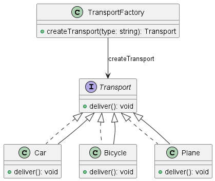

# Go

В веб-приложениях, которые интенсивно взаимодействуют с базой данных, управление соединениями может стать проблемой. Создание и закрытие соединений с базой данных для каждого запроса может быть неэффективным. Пул соединений позволяет управлять соединениями, предоставляя их по мере необходимости и возвращая обратно в пул после использования.

#### Структуры и функции

**Структура `DatabaseConnection`**

```go
type DatabaseConnection struct {
	db    *sql.DB
	cache map[string][]map[string]interface{}
}
```

* **Поля:**
  * `db`: Объект `sql.DB`, представляющий соединение с базой данных.
  * `cache`: Карта для кэширования результатов запросов.
* **Методы:**
  * `NewDatabaseConnection(db *sql.DB) *DatabaseConnection`: Конструктор для создания нового объекта `DatabaseConnection`.
  * `Query(query string) ([]map[string]interface{}, error)`: Метод для выполнения запроса к базе данных. Если результат запроса уже есть в кэше, возвращается кэшированный результат. В противном случае выполняется запрос к базе данных, результат кэшируется и возвращается.

**Структура `DatabasePool`**

```go
type DatabasePool struct {
	connections []*DatabaseConnection
	mu          sync.Mutex
}
```

* **Поля:**
  * `connections`: Массив объектов `DatabaseConnection`, представляющих пул соединений.
  * `mu`: Мьютекс для синхронизации доступа к пулу соединений.
* **Методы:**
  * `NewDatabasePool(db *sql.DB, size int) *DatabasePool`: Конструктор для создания нового объекта `DatabasePool` с заданным количеством соединений.
  * `GetConnection() *DatabaseConnection`: Метод для получения соединения из пула. Если пул пуст, создается новое соединение.
  * `ReleaseConnection(conn *DatabaseConnection)`: Метод для возвращения соединения обратно в пул.

#### Использование

```go
func main() {
	db, err := sql.Open("mysql", "user:password@tcp(localhost:3306)/test")
	if err != nil {
		log.Fatal(err)
	}
	defer db.Close()

	pool := NewDatabasePool(db, 10)

	// Получаем объект соединения из пулла
	connection := pool.GetConnection()

	// Выполняем запрос
	result, err := connection.Query("SELECT * FROM users")
	if err != nil {
		log.Fatal(err)
	}

	fmt.Println(result)
	
	// Возвращаем объект соединения в пул
	pool.ReleaseConnection(connection)
}
```

*   **Описание:**

    * Создается соединение с базой данных с помощью `sql.Open`.
    * Создается пул соединений с помощью `NewDatabasePool`.
    * Из пула получается соединение с помощью `GetConnection`.
    * Выполняется запрос к базе данных с помощью метода `Query` объекта `DatabaseConnection`.
    * Результат запроса выводится на экран.
    * Соединение возвращается обратно в пул с помощью `ReleaseConnection`.


<figure><figcaption><p>UML диаграмма для паттерна "Пулл объектов"</p></figcaption></figure>


```plant-uml
@startuml

class DatabaseConnection {
  -db: sql.DB
  -cache: map[string][]map[string]interface{}
  +NewDatabaseConnection(db: sql.DB): DatabaseConnection
  +Query(query: string): ([]map[string]interface{}, error)
}

class DatabasePool {
  -connections: []*DatabaseConnection
  -mu: sync.Mutex
  +NewDatabasePool(db: sql.DB, size: int): DatabasePool
  +GetConnection(): DatabaseConnection
  +ReleaseConnection(conn: DatabaseConnection): void
}

class sql.DB {
  +Open(driverName: string, dataSourceName: string): (*sql.DB, error)
  +Close(): error
  +Query(query: string): (*sql.Rows, error)
}

DatabasePool --> DatabaseConnection : contains
DatabaseConnection --> sql.DB : uses

@enduml
```


Эта диаграмма отображает следующие классы и их взаимосвязи:

* `DatabaseConnection`: Представляет соединение с базой данных. Содержит поля `db` и `cache`, а также методы `NewDatabaseConnection` и `Query`.
* `DatabasePool`: Представляет пул соединений с базой данных. Содержит поле `connections` и методы `NewDatabasePool`, `GetConnection`, и `ReleaseConnection`.
* `sql.DB`: Представляет собой стандартный объект для работы с базой данных в Go. Содержит методы `Open`, `Close`, и `Query`.

Связи между классами:

* `DatabasePool` содержит (`contains`) объекты `DatabaseConnection`.
* `DatabaseConnection` использует (`uses`) объект `sql.DB`.

Этот пример демонстрирует, как можно управлять пулом соединений с базой данных в Go, обеспечивая эффективное использование ресурсов и улучшая производительность приложения.

