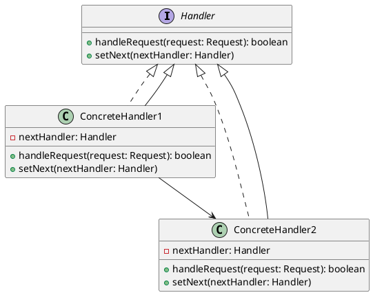

# Цепочка обязанностей (Chain of Responsibility)

### **Описание паттерна**

Цепочка обязанностей — это поведенческий паттерн проектирования, который позволяет передавать запросы последовательно по цепочке обработчиков. Каждый обработчик решает, может ли он обработать запрос сам, и если нет, передает его следующему обработчику в цепочке. Этот паттерн позволяет избежать жесткой привязки отправителя запроса к его получателю, давая возможность нескольким объектам обрабатывать запрос.

### UML диаграмма

<figure><figcaption>
UML диаграмма для паттерна "Цепочка обязанностей"
</figcaption></figure>





### Основные элементы паттерна

**Handler (Обработчик)**:

* **Описание**: Определяет интерфейс для обработки запросов. Обработчик может либо обработать запрос самостоятельно, либо передать его следующему обработчику в цепочке.
* **Методы**:
  * `handleRequest(request: Request): boolean`: Метод для обработки запроса. Возвращает `true`, если запрос был обработан, и `false`, если запрос должен быть передан дальше.
  * `setNext(nextHandler: Handler)`: Метод для установки следующего обработчика в цепочке.

**ConcreteHandler1 (Конкретный обработчик 1)**:

* **Описание**: Конкретный обработчик, который реализует метод `handleRequest` и может обрабатывать запросы определенного типа.
* **Поля**:
  * `nextHandler: Handler`: Ссылка на следующий обработчик в цепочке.
* **Методы**:
  * `handleRequest(request: Request): boolean`: Реализация метода для обработки запроса. Если запрос не может быть обработан, он передается следующему обработчику.
  * `setNext(nextHandler: Handler)`: Реализация метода для установки следующего обработчика в цепочке.

**ConcreteHandler2 (Конкретный обработчик 2)**:

* **Описание**: Еще один конкретный обработчик, который реализует метод `handleRequest` и может обрабатывать запросы другого типа.
* **Поля**:
  * `nextHandler: Handler`: Ссылка на следующий обработчик в цепочке.
* **Методы**:
  * `handleRequest(request: Request): boolean`: Реализация метода для обработки запроса. Если запрос не может быть обработан, он передается следующему обработчику.
  * `setNext(nextHandler: Handler)`: Реализация метода для установки следующего обработчика в цепочке.

### Преимущества паттерна "Цепочка обязанностей"

* **Гибкость**: Позволяет добавлять новые обработчики без изменения существующего кода.
* **Разделение обязанностей**: Каждый обработчик отвечает только за свою часть задачи, что упрощает код и улучшает его читаемость.
* **Упрощение кода**: Упрощает код, так как каждый обработчик решает только свою задачу и не заботится о других обработчиках.

### Недостатки паттерна "Цепочка обязанностей"

* **Сложность отладки**: Может быть сложно отлаживать, так как запрос может пройти через несколько обработчиков, и трудно понять, где именно он был обработан.
* **Производительность**: В некоторых случаях может негативно сказаться на производительности из-за передачи запросов по цепочке.

### Применение паттерна "Цепочка обязанностей"

* **Обработка запросов**: Когда нужно обрабатывать запросы различных типов, и каждый тип запроса должен быть обработан отдельным обработчиком.
* **Логирование**: Когда нужно логировать запросы на разных уровнях (например, информация, предупреждение, ошибка).
* **Аутентификация и авторизация**: Когда нужно проверять права доступа на разных уровнях.
* **Маршрутизация**: Когда нужно маршрутизировать запросы по разным обработчикам в зависимости от их типа.

### Примеры использования паттерна "Цепочка обязанностей"

* **Обработка сообщений**: В системах обработки сообщений, где каждый обработчик может обрабатывать определенный тип сообщений.
* **Обработка исключений**: В системах обработки исключений, где каждый обработчик может обрабатывать определенный тип исключений.
* **Фильтрация данных**: В системах фильтрации данных, где каждый фильтр может обрабатывать определенный тип данных.

Паттерн "Цепочка обязанностей" является мощным инструментом для обработки запросов и разделения обязанностей между различными обработчиками. Он широко используется в различных областях, таких как обработка сообщений, логирование, аутентификация и авторизация, а также маршрутизация запросов.
