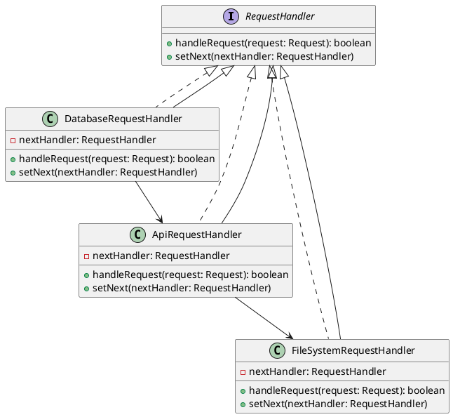

# Go

Представьте, что вы работаете в команде разработчиков, которая занимается созданием и поддержкой веб-приложения. Ваш сеньор-разработчик поставил задачу: переделать маршрутизацию запросов в микросервисной архитектуре. Ваша задача — сделать систему маршрутизации более гибкой и удобной для расширения. Для этого вы решили использовать паттерн "Цепочка обязанностей".

### Описание кейса

Ваше веб-приложение состоит из нескольких микросервисов, каждый из которых обрабатывает определенный тип запросов. Например, один микросервис может обрабатывать запросы к базе данных, другой — запросы к внешним API, а третий — запросы к файловой системе. Ваша цель — создать цепочку обработчиков, каждый из которых будет отвечать за маршрутизацию запросов к соответствующему микросервису.

### UML диаграмма

<figure><figcaption><p>UML диаграмма для паттерна "Цепочка обязанностей"</p></figcaption></figure>





### Пример кода на Go

**Интерфейс RequestHandler**


```go
package main

import "fmt"

type Request struct {
    Type string
    Data string
}

type RequestHandler interface {
    handleRequest(request Request) bool
    setNext(handler RequestHandler)
}
```


**Абстрактный класс AbstractRequestHandler**


```go
type AbstractRequestHandler struct {
    nextHandler RequestHandler
}

func (h *AbstractRequestHandler) setNext(handler RequestHandler) {
    h.nextHandler = handler
}

func (h *AbstractRequestHandler) handleRequest(request Request) bool {
    if h.canHandle(request) {
        h.process(request)
        return true
    }
    if h.nextHandler != nil {
        return h.nextHandler.handleRequest(request)
    }
    return false
}

func (h *AbstractRequestHandler) canHandle(request Request) bool {
    return false
}

func (h *AbstractRequestHandler) process(request Request) {
    // Реализация в конкретных обработчиках
}
```


**Конкретный обработчик DatabaseRequestHandler**


```go
type DatabaseRequestHandler struct {
    AbstractRequestHandler
}

func (h *DatabaseRequestHandler) canHandle(request Request) bool {
    return request.Type == "database"
}

func (h *DatabaseRequestHandler) process(request Request) {
    fmt.Printf("Обработка запроса к базе данных: %s\n", request.Data)
}
```


**Конкретный обработчик ApiRequestHandler**


```go
type ApiRequestHandler struct {
    AbstractRequestHandler
}

func (h *ApiRequestHandler) canHandle(request Request) bool {
    return request.Type == "api"
}

func (h *ApiRequestHandler) process(request Request) {
    fmt.Printf("Обработка запроса к внешнему API: %s\n", request.Data)
}
```


**Конкретный обработчик FileSystemRequestHandler**


```go
type FileSystemRequestHandler struct {
    AbstractRequestHandler
}

func (h *FileSystemRequestHandler) canHandle(request Request) bool {
    return request.Type == "filesystem"
}

func (h *FileSystemRequestHandler) process(request Request) {
    fmt.Printf("Обработка запроса к файловой системе: %s\n", request.Data)
}
```


**Использование цепочки обязанностей**


```go
func main() {
    // Создание цепочки обработчиков
    fileSystemHandler := &FileSystemRequestHandler{}
    apiHandler := &ApiRequestHandler{}
    databaseHandler := &DatabaseRequestHandler{}

    databaseHandler.setNext(apiHandler)
    apiHandler.setNext(fileSystemHandler)

    // Пример использования
    requests := []Request{
        {Type: "database", Data: "SELECT * FROM users"},
        {Type: "api", Data: "GET /api/users"},
        {Type: "filesystem", Data: "READ /path/to/file"},
    }

    for _, request := range requests {
        databaseHandler.handleRequest(request)
    }
}
```


### Объяснение кода

1. **Интерфейс RequestHandler**:
   * Определяет методы `handleRequest` и `setNext`, которые должны быть реализованы всеми обработчиками.
2. **Абстрактный класс AbstractRequestHandler**:
   * Реализует метод `setNext` для установки следующего обработчика в цепочке.
   * Метод `handleRequest` проверяет, может ли текущий обработчик обработать запрос. Если нет, он передает запрос следующему обработчику.
   * Методы `canHandle` и `process` должны быть реализованы в конкретных обработчиках.
3. **Конкретные обработчики**:
   * `DatabaseRequestHandler`, `ApiRequestHandler`, `FileSystemRequestHandler` реализуют методы `canHandle` и `process` для обработки соответствующих типов запросов.
4. **Использование цепочки обязанностей**:
   * Создаются экземпляры обработчиков и устанавливается цепочка.
   * При возникновении запроса, он передается в цепочку обработчиков, где каждый обработчик проверяет, может ли он обработать запрос.

### Вывод

Паттерн "Цепочка обязанностей" позволяет гибко и эффективно маршрутизировать запросы в микросервисной архитектуре. Этот подход упрощает добавление новых обработчиков и делает код более читаемым и поддерживаемым. В данном кейсе мы показали, как можно использовать этот паттерн для маршрутизации запросов к базе данных, внешним API и файловой системе.
