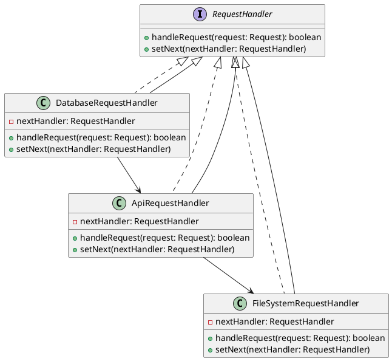

# PHP

Представьте, что вы работаете в команде разработчиков, которая занимается созданием и поддержкой веб-приложения. Ваш сеньор-разработчик поставил задачу: переделать маршрутизацию запросов в микросервисной архитектуре. Ваша задача — сделать систему маршрутизации более гибкой и удобной для расширения. Для этого вы решили использовать паттерн "Цепочка обязанностей".

### Описание кейса

Ваше веб-приложение состоит из нескольких микросервисов, каждый из которых обрабатывает определенный тип запросов. Например, один микросервис может обрабатывать запросы к базе данных, другой — запросы к внешним API, а третий — запросы к файловой системе. Ваша цель — создать цепочку обработчиков, каждый из которых будет отвечать за маршрутизацию запросов к соответствующему микросервису.

### UML диаграмма

<figure><figcaption><p>UML диаграмма для паттерна "Цепочка обязанностей"</p></figcaption></figure>





### Пример кода на PHP

**Интерфейс RequestHandler**


```php
<?php
interface RequestHandler {
    public function handleRequest($request): bool;
    public function setNext(RequestHandler $nextHandler);
}
?>
```


**Абстрактный класс AbstractRequestHandler**


```php
<?php
abstract class AbstractRequestHandler implements RequestHandler {
    private $nextHandler;

    public function setNext(RequestHandler $nextHandler) {
        $this->nextHandler = $nextHandler;
    }

    public function handleRequest($request): bool {
        if ($this->canHandle($request)) {
            $this->process($request);
            return true;
        }
        if ($this->nextHandler) {
            return $this->nextHandler->handleRequest($request);
        }
        return false;
    }

    abstract protected function canHandle($request): bool;
    abstract protected function process($request);
}
?>
```


**Конкретный обработчик DatabaseRequestHandler**


```php
<?php
class DatabaseRequestHandler extends AbstractRequestHandler {
    protected function canHandle($request): bool {
        return $request['type'] === 'database';
    }

    protected function process($request) {
        // Логика обработки запроса к базе данных
        echo "Обработка запроса к базе данных: " . $request['data'] . "\n";
    }
}
?>
```


**Конкретный обработчик ApiRequestHandler**


```php
<?php
class ApiRequestHandler extends AbstractRequestHandler {
    protected function canHandle($request): bool {
        return $request['type'] === 'api';
    }

    protected function process($request) {
        // Логика обработки запроса к внешнему API
        echo "Обработка запроса к внешнему API: " . $request['data'] . "\n";
    }
}
?>
```


**Конкретный обработчик FileSystemRequestHandler**


```php
<?php
class FileSystemRequestHandler extends AbstractRequestHandler {
    protected function canHandle($request): bool {
        return $request['type'] === 'filesystem';
    }

    protected function process($request) {
        // Логика обработки запроса к файловой системе
        echo "Обработка запроса к файловой системе: " . $request['data'] . "\n";
    }
}
?>
```


**Использование цепочки обязанностей**


```php
<?php
function main() {
    // Создание цепочки обработчиков
    $fileSystemHandler = new FileSystemRequestHandler();
    $apiHandler = new ApiRequestHandler();
    $databaseHandler = new DatabaseRequestHandler();

    $databaseHandler->setNext($apiHandler);
    $apiHandler->setNext($fileSystemHandler);

    // Пример использования
    $requests = [
        ['type' => 'database', 'data' => 'SELECT * FROM users'],
        ['type' => 'api', 'data' => 'GET /api/users'],
        ['type' => 'filesystem', 'data' => 'READ /path/to/file'],
    ];

    foreach ($requests as $request) {
        $databaseHandler->handleRequest($request);
    }
}

main();
?>
```


### Объяснение кода

1. **Интерфейс RequestHandler**:
   * Определяет методы `handleRequest` и `setNext`, которые должны быть реализованы всеми обработчиками.
2. **Абстрактный класс AbstractRequestHandler**:
   * Реализует метод `setNext` для установки следующего обработчика в цепочке.
   * Метод `handleRequest` проверяет, может ли текущий обработчик обработать запрос. Если нет, он передает запрос следующему обработчику.
   * Абстрактные методы `canHandle` и `process` должны быть реализованы в конкретных обработчиках.
3. **Конкретные обработчики**:
   * `DatabaseRequestHandler`, `ApiRequestHandler`, `FileSystemRequestHandler` реализуют методы `canHandle` и `process` для обработки соответствующих типов запросов.
4. **Использование цепочки обязанностей**:
   * Создаются экземпляры обработчиков и устанавливается цепочка.
   * При возникновении запроса, он передается в цепочку обработчиков, где каждый обработчик проверяет, может ли он обработать запрос.

### Вывод

Паттерн "Цепочка обязанностей" позволяет гибко и эффективно маршрутизировать запросы в микросервисной архитектуре. Этот подход упрощает добавление новых обработчиков и делает код более читаемым и поддерживаемым. В данном кейсе мы показали, как можно использовать этот паттерн для маршрутизации запросов к базе данных, внешним API и файловой системе.
