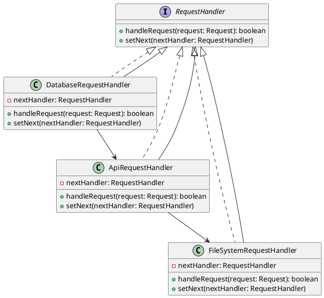

# Python

Представьте, что вы работаете в команде разработчиков, которая занимается созданием и поддержкой веб-приложения. Ваш сеньор-разработчик поставил задачу: переделать маршрутизацию запросов в микросервисной архитектуре. Ваша задача — сделать систему маршрутизации более гибкой и удобной для расширения. Для этого вы решили использовать паттерн "Цепочка обязанностей".

### Описание кейса

Ваше веб-приложение состоит из нескольких микросервисов, каждый из которых обрабатывает определенный тип запросов. Например, один микросервис может обрабатывать запросы к базе данных, другой — запросы к внешним API, а третий — запросы к файловой системе. Ваша цель — создать цепочку обработчиков, каждый из которых будет отвечать за маршрутизацию запросов к соответствующему микросервису.

### UML диаграмма

<figure><figcaption><p>UML диаграмма для паттерна "Цепочка обязанностей"</p></figcaption></figure>





### Пример кода на Python

**Интерфейс RequestHandler**


```python
from abc import ABC, abstractmethod

class Request:
    def __init__(self, type, data):
        self.type = type
        self.data = data

class RequestHandler(ABC):
    def __init__(self):
        self.next_handler = None

    def set_next(self, handler):
        self.next_handler = handler

    @abstractmethod
    def handle_request(self, request):
        pass
```


**Абстрактный класс AbstractRequestHandler**


```python
class AbstractRequestHandler(RequestHandler):
    def handle_request(self, request):
        if self.can_handle(request):
            self.process(request)
            return True
        if self.next_handler:
            return self.next_handler.handle_request(request)
        return False

    @abstractmethod
    def can_handle(self, request):
        pass

    @abstractmethod
    def process(self, request):
        pass
```


**Конкретный обработчик DatabaseRequestHandler**


```python
class DatabaseRequestHandler(AbstractRequestHandler):
    def can_handle(self, request):
        return request.type == 'database'

    def process(self, request):
        print(f"Обработка запроса к базе данных: {request.data}")
```


**Конкретный обработчик ApiRequestHandler**


```python
class ApiRequestHandler(AbstractRequestHandler):
    def can_handle(self, request):
        return request.type == 'api'

    def process(self, request):
        print(f"Обработка запроса к внешнему API: {request.data}")
```


**Конкретный обработчик FileSystemRequestHandler**


```python
class FileSystemRequestHandler(AbstractRequestHandler):
    def can_handle(self, request):
        return request.type == 'filesystem'

    def process(self, request):
        print(f"Обработка запроса к файловой системе: {request.data}")
```


**Использование цепочки обязанностей**


```python
def main():
    # Создание цепочки обработчиков
    file_system_handler = FileSystemRequestHandler()
    api_handler = ApiRequestHandler()
    database_handler = DatabaseRequestHandler()

    database_handler.set_next(api_handler)
    api_handler.set_next(file_system_handler)

    # Пример использования
    requests = [
        Request(type='database', data='SELECT * FROM users'),
        Request(type='api', data='GET /api/users'),
        Request(type='filesystem', data='READ /path/to/file'),
    ]

    for request in requests:
        database_handler.handle_request(request)

if __name__ == "__main__":
    main()
```


### Объяснение кода

1. **Интерфейс RequestHandler**:
   * Определяет методы `handle_request` и `set_next`, которые должны быть реализованы всеми обработчиками.
2. **Абстрактный класс AbstractRequestHandler**:
   * Реализует метод `set_next` для установки следующего обработчика в цепочке.
   * Метод `handle_request` проверяет, может ли текущий обработчик обработать запрос. Если нет, он передает запрос следующему обработчику.
   * Абстрактные методы `can_handle` и `process` должны быть реализованы в конкретных обработчиках.
3. **Конкретные обработчики**:
   * `DatabaseRequestHandler`, `ApiRequestHandler`, `FileSystemRequestHandler` реализуют методы `can_handle` и `process` для обработки соответствующих типов запросов.
4. **Использование цепочки обязанностей**:
   * Создаются экземпляры обработчиков и устанавливается цепочка.
   * При возникновении запроса, он передается в цепочку обработчиков, где каждый обработчик проверяет, может ли он обработать запрос.

### Вывод

Паттерн "Цепочка обязанностей" позволяет гибко и эффективно маршрутизировать запросы в микросервисной архитектуре. Этот подход упрощает добавление новых обработчиков и делает код более читаемым и поддерживаемым. В данном кейсе мы показали, как можно использовать этот паттерн для маршрутизации запросов к базе данных, внешним API и файловой системе.
