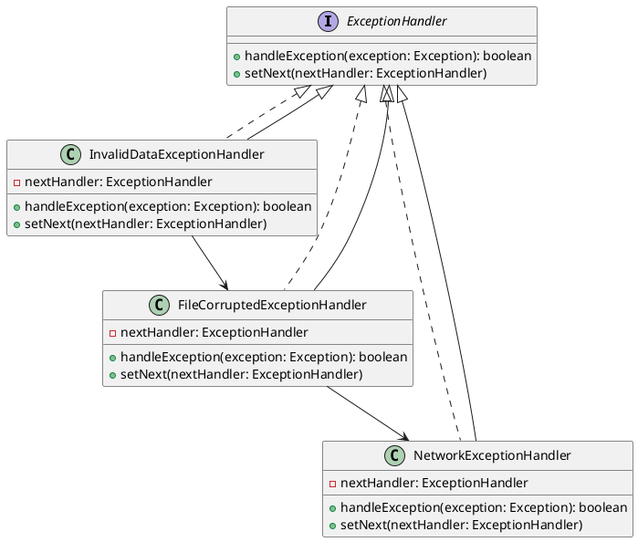

# Go

Представьте, что вы работаете в команде разработчиков, которая занимается созданием и поддержкой веб-приложения. Ваш сеньор-разработчик поставил задачу: переделать обработку исключений для парсера данных. Ваша задача — сделать систему обработки исключений более гибкой и удобной для расширения. Для этого вы решили использовать паттерн "Цепочка обязанностей".

### Описание кейса

Ваш парсер данных обрабатывает различные типы данных и может вызывать разные исключения. Например, данные могут быть некорректными, файл может быть поврежден, или может возникнуть сетевая ошибка. Ваша цель — создать цепочку обработчиков, каждый из которых будет отвечать за обработку определенного типа исключений.

### UML диаграмма

<figure><figcaption><p>UML диаграмма для паттерна "Цепочка обязанностей"</p></figcaption></figure>





### Пример кода на Go

**Интерфейс ExceptionHandler**


```go
package main

import (
	"fmt"
)

type ExceptionHandler interface {
	handleException(error) bool
	setNext(ExceptionHandler)
}
```


**Абстрактный класс AbstractExceptionHandler**


```go
type AbstractExceptionHandler struct {
	nextHandler ExceptionHandler
}

func (h *AbstractExceptionHandler) setNext(nextHandler ExceptionHandler) {
	h.nextHandler = nextHandler
}

func (h *AbstractExceptionHandler) handleException(exception error) bool {
	if h.canHandle(exception) {
		h.process(exception)
		return true
	}
	if h.nextHandler != nil {
		return h.nextHandler.handleException(exception)
	}
	return false
}

func (h *AbstractExceptionHandler) canHandle(exception error) bool {
	return false
}

func (h *AbstractExceptionHandler) process(exception error) {
	// Реализация в конкретных обработчиках
}
```


**Конкретный обработчик InvalidDataExceptionHandler**


```go
type InvalidDataException struct {
	msg string
}

func (e *InvalidDataException) Error() string {
	return e.msg
}

type InvalidDataExceptionHandler struct {
	AbstractExceptionHandler
}

func (h *InvalidDataExceptionHandler) canHandle(exception error) bool {
	_, ok := exception.(*InvalidDataException)
	return ok
}

func (h *InvalidDataExceptionHandler) process(exception error) {
	fmt.Printf("Обработка исключения некорректных данных: %s\n", exception.Error())
}
```


**Конкретный обработчик FileCorruptedExceptionHandler**


```go
type FileCorruptedException struct {
	msg string
}

func (e *FileCorruptedException) Error() string {
	return e.msg
}

type FileCorruptedExceptionHandler struct {
	AbstractExceptionHandler
}

func (h *FileCorruptedExceptionHandler) canHandle(exception error) bool {
	_, ok := exception.(*FileCorruptedException)
	return ok
}

func (h *FileCorruptedExceptionHandler) process(exception error) {
	fmt.Printf("Обработка исключения поврежденного файла: %s\n", exception.Error())
}
```


**Конкретный обработчик NetworkExceptionHandler**


```go
type NetworkException struct {
	msg string
}

func (e *NetworkException) Error() string {
	return e.msg
}

type NetworkExceptionHandler struct {
	AbstractExceptionHandler
}

func (h *NetworkExceptionHandler) canHandle(exception error) bool {
	_, ok := exception.(*NetworkException)
	return ok
}

func (h *NetworkExceptionHandler) process(exception error) {
	fmt.Printf("Обработка исключения сетевой ошибки: %s\n", exception.Error())
}
```


**Использование цепочки обязанностей**


```go
func main() {
	// Создание цепочки обработчиков
	networkHandler := &NetworkExceptionHandler{}
	fileHandler := &FileCorruptedExceptionHandler{}
	invalidDataHandler := &InvalidDataExceptionHandler{}

	invalidDataHandler.setNext(fileHandler)
	fileHandler.setNext(networkHandler)

	// Пример использования
	exceptions := []error{
		&InvalidDataException{msg: "Некорректные данные"},
		&FileCorruptedException{msg: "Файл поврежден"},
		&NetworkException{msg: "Сетевая ошибка"},
	}

	for _, exception := range exceptions {
		invalidDataHandler.handleException(exception)
	}
}
```


### Объяснение кода

1. **Интерфейс ExceptionHandler**:
   * Определяет методы `handleException` и `setNext`, которые должны быть реализованы всеми обработчиками.
2. **Абстрактный класс AbstractExceptionHandler**:
   * Реализует метод `setNext` для установки следующего обработчика в цепочке.
   * Метод `handleException` проверяет, может ли текущий обработчик обработать исключение. Если нет, он передает исключение следующему обработчику.
   * Методы `canHandle` и `process` должны быть реализованы в конкретных обработчиках.
3. **Конкретные обработчики**:
   * `InvalidDataExceptionHandler`, `FileCorruptedExceptionHandler`, `NetworkExceptionHandler` реализуют методы `canHandle` и `process` для обработки соответствующих типов исключений.
4. **Использование цепочки обязанностей**:
   * Создаются экземпляры обработчиков и устанавливается цепочка.
   * При возникновении исключения, оно передается в цепочку обработчиков, где каждый обработчик проверяет, может ли он обработать исключение.

### Вывод

Паттерн "Цепочка обязанностей" позволяет гибко и эффективно обрабатывать различные типы исключений в вашем парсере данных. Этот подход упрощает добавление новых обработчиков и делает код более читаемым и поддерживаемым. В данном кейсе мы показали, как можно использовать этот паттерн для обработки исключений некорректных данных, поврежденных файлов и сетевых ошибок.
