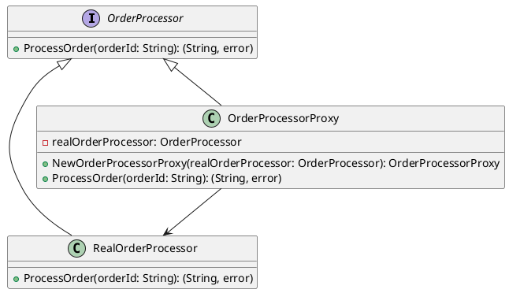

# Go

Представьте, что мы работаем в компании, которая разрабатывает веб-приложение для управления заказами. Наше приложение должно уметь обрабатывать заказы, но иногда сервер, который обрабатывает заказы, может быть недоступен. Мы хотим, чтобы наше приложение не падало в таких случаях, а пыталось повторно отправить заказ через некоторое время.

Для этого мы будем использовать паттерн "Заместитель" (Proxy). Этот паттерн позволяет нам создать объект-заместитель, который будет выполнять дополнительные действия перед вызовом основного объекта. В нашем случае заместитель будет обрабатывать ошибки и делать повторные попытки.

#### Пример кода на Go

**1. Создание интерфейса для обработки заказов**


```go
package main

import (
	"errors"
	"fmt"
	"math/rand"
	"time"
)

type OrderProcessor interface {
	ProcessOrder(orderId string) (string, error)
}
```


**2. Создание основного класса для обработки заказов**


```go
type RealOrderProcessor struct{}

func (rop *RealOrderProcessor) ProcessOrder(orderId string) (string, error) {
	// Симуляция обработки заказа
	if rand.Intn(2) == 0 {
		return "", errors.New("Сервер недоступен")
	}
	return fmt.Sprintf("Заказ %s успешно обработан", orderId), nil
}
```


**3. Создание класса-заместителя**


```go
type OrderProcessorProxy struct {
	realOrderProcessor OrderProcessor
}

func NewOrderProcessorProxy(realOrderProcessor OrderProcessor) *OrderProcessorProxy {
	return &OrderProcessorProxy{realOrderProcessor: realOrderProcessor}
}

func (opp *OrderProcessorProxy) ProcessOrder(orderId string) (string, error) {
	attempts := 3
	for attempts > 0 {
		result, err := opp.realOrderProcessor.ProcessOrder(orderId)
		if err == nil {
			return result, nil
		}
		attempts--
		if attempts == 0 {
			return "", err
		}
		fmt.Println("Повторная попытка...")
		time.Sleep(1 * time.Second) // Пауза перед повторной попыткой
	}
	return "", errors.New("Не удалось обработать заказ")
}
```


**4. Использование класса-заместителя**


```go
func main() {
	realOrderProcessor := &RealOrderProcessor{}
	orderProcessorProxy := NewOrderProcessorProxy(realOrderProcessor)

	result, err := orderProcessorProxy.ProcessOrder("12345")
	if err != nil {
		fmt.Printf("Ошибка: %v\n", err)
	} else {
		fmt.Println(result)
	}
}
```


#### UML диаграмма

<figure><figcaption><p>UML диаграмма для паттерна "Заместитель"</p></figcaption></figure>





#### Вывод для кейса

В этом кейсе мы использовали паттерн "Заместитель" для обработки ошибок и повторных попыток при обработке заказов. Основной класс `RealOrderProcessor` выполняет реальную обработку заказов, а класс-заместитель `OrderProcessorProxy` обрабатывает ошибки и делает повторные попытки.

Этот подход позволяет нам сделать наше приложение более устойчивым к сбоям и улучшить пользовательский опыт, так как приложение не падает при временных проблемах с сервером.
