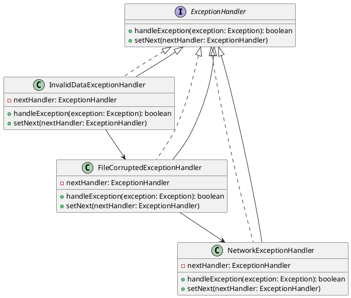

# Python

Представьте, что вы работаете в команде разработчиков, которая занимается созданием и поддержкой веб-приложения. Ваш сеньор-разработчик поставил задачу: переделать обработку исключений для парсера данных. Ваша задача — сделать систему обработки исключений более гибкой и удобной для расширения. Для этого вы решили использовать паттерн "Цепочка обязанностей".

### Описание кейса

Ваш парсер данных обрабатывает различные типы данных и может вызывать разные исключения. Например, данные могут быть некорректными, файл может быть поврежден, или может возникнуть сетевая ошибка. Ваша цель — создать цепочку обработчиков, каждый из которых будет отвечать за обработку определенного типа исключений.

### UML диаграмма

<figure><figcaption><p>UML диаграмма для паттерна "Цепочка обязанностей"</p></figcaption></figure>





### Пример кода на Python

**Интерфейс ExceptionHandler**


```python
from abc import ABC, abstractmethod

class ExceptionHandler(ABC):
    def __init__(self):
        self.next_handler = None

    def set_next(self, handler):
        self.next_handler = handler

    @abstractmethod
    def handle_exception(self, exception):
        pass
```


**Абстрактный класс AbstractExceptionHandler**


```python
class AbstractExceptionHandler(ExceptionHandler):
    def handle_exception(self, exception):
        if self.can_handle(exception):
            self.process(exception)
            return True
        if self.next_handler:
            return self.next_handler.handle_exception(exception)
        return False

    @abstractmethod
    def can_handle(self, exception):
        pass

    @abstractmethod
    def process(self, exception):
        pass
```


**Конкретный обработчик InvalidDataExceptionHandler**


```python
class InvalidDataException(Exception):
    pass

class InvalidDataExceptionHandler(AbstractExceptionHandler):
    def can_handle(self, exception):
        return isinstance(exception, InvalidDataException)

    def process(self, exception):
        print(f"Обработка исключения некорректных данных: {exception}")
```


**Конкретный обработчик FileCorruptedExceptionHandler**


```python
class FileCorruptedException(Exception):
    pass

class FileCorruptedExceptionHandler(AbstractExceptionHandler):
    def can_handle(self, exception):
        return isinstance(exception, FileCorruptedException)

    def process(self, exception):
        print(f"Обработка исключения поврежденного файла: {exception}")
```


**Конкретный обработчик NetworkExceptionHandler**


```python
class NetworkException(Exception):
    pass

class NetworkExceptionHandler(AbstractExceptionHandler):
    def can_handle(self, exception):
        return isinstance(exception, NetworkException)

    def process(self, exception):
        print(f"Обработка исключения сетевой ошибки: {exception}")
```


**Использование цепочки обязанностей**


```python
def main():
    # Создание цепочки обработчиков
    network_handler = NetworkExceptionHandler()
    file_handler = FileCorruptedExceptionHandler()
    invalid_data_handler = InvalidDataExceptionHandler()

    invalid_data_handler.set_next(file_handler)
    file_handler.set_next(network_handler)

    # Пример использования
    exceptions = [
        InvalidDataException("Некорректные данные"),
        FileCorruptedException("Файл поврежден"),
        NetworkException("Сетевая ошибка"),
    ]

    for exception in exceptions:
        invalid_data_handler.handle_exception(exception)

if __name__ == "__main__":
    main()
```


### Объяснение кода

1. **Интерфейс ExceptionHandler**:
   * Определяет методы `handle_exception` и `set_next`, которые должны быть реализованы всеми обработчиками.
2. **Абстрактный класс AbstractExceptionHandler**:
   * Реализует метод `set_next` для установки следующего обработчика в цепочке.
   * Метод `handle_exception` проверяет, может ли текущий обработчик обработать исключение. Если нет, он передает исключение следующему обработчику.
   * Абстрактные методы `can_handle` и `process` должны быть реализованы в конкретных обработчиках.
3. **Конкретные обработчики**:
   * `InvalidDataExceptionHandler`, `FileCorruptedExceptionHandler`, `NetworkExceptionHandler` реализуют методы `can_handle` и `process` для обработки соответствующих типов исключений.
4. **Использование цепочки обязанностей**:
   * Создаются экземпляры обработчиков и устанавливается цепочка.
   * При возникновении исключения, оно передается в цепочку обработчиков, где каждый обработчик проверяет, может ли он обработать исключение.

### Вывод

Паттерн "Цепочка обязанностей" позволяет гибко и эффективно обрабатывать различные типы исключений в вашем парсере данных. Этот подход упрощает добавление новых обработчиков и делает код более читаемым и поддерживаемым. В данном кейсе мы показали, как можно использовать этот паттерн для обработки исключений некорректных данных, поврежденных файлов и сетевых ошибок.
