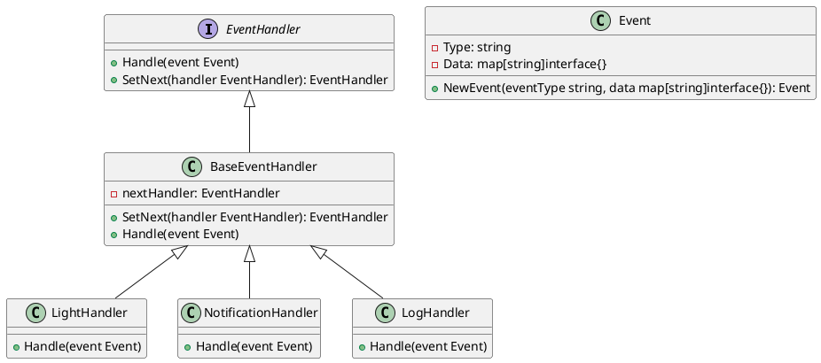

# Go

Представьте, что мы работаем в компании, которая разрабатывает системы мониторинга и управления умным домом. Наша задача — обрабатывать события, которые происходят в реальном времени, такие как открытие двери, включение света или изменение температуры. Мы хотим, чтобы каждое событие проходило через цепочку обработчиков, которые могут реагировать на него по-разному. Например, если дверь открывается, мы можем захотеть включить свет, отправить уведомление на телефон и записать это событие в журнал.

### Описание

Паттерн Цепочка обязанностей (Chain of Responsibility) позволяет передавать запросы последовательно по цепочке обработчиков. Каждый обработчик решает, может ли он обработать запрос сам или передать его дальше по цепочке. Этот паттерн особенно полезен, когда у нас есть несколько обработчиков, которые могут реагировать на одно и то же событие.

### Пример кода на Go

**1. Создание интерфейса обработчика**


```go
package main

import "fmt"

type EventHandler interface {
    Handle(event Event)
    SetNext(handler EventHandler) EventHandler
}
```


**2. Создание базового класса обработчика**


```go
type BaseEventHandler struct {
    nextHandler EventHandler
}

func (b *BaseEventHandler) SetNext(handler EventHandler) EventHandler {
    b.nextHandler = handler
    return handler
}

func (b *BaseEventHandler) Handle(event Event) {
    if b.nextHandler != nil {
        b.nextHandler.Handle(event)
    }
}
```


**3. Создание класса события**


```go
type Event struct {
    Type string
    Data map[string]interface{}
}

func NewEvent(eventType string, data map[string]interface{}) Event {
    return Event{Type: eventType, Data: data}
}
```


**4. Создание конкретных обработчиков**


```go
type LightHandler struct {
    BaseEventHandler
}

func (l *LightHandler) Handle(event Event) {
    if event.Type == "door_open" {
        fmt.Println("Turning on the light.")
    }
    l.BaseEventHandler.Handle(event)
}

type NotificationHandler struct {
    BaseEventHandler
}

func (n *NotificationHandler) Handle(event Event) {
    if event.Type == "door_open" {
        fmt.Println("Sending notification to the phone.")
    }
    n.BaseEventHandler.Handle(event)
}

type LogHandler struct {
    BaseEventHandler
}

func (l *LogHandler) Handle(event Event) {
    fmt.Printf("Logging event: %s\n", event.Type)
    l.BaseEventHandler.Handle(event)
}
```


**5. Создание цепочки обработчиков и обработка события**


```go
func main() {
    lightHandler := &LightHandler{}
    notificationHandler := &NotificationHandler{}
    logHandler := &LogHandler{}

    lightHandler.SetNext(notificationHandler).SetNext(logHandler)

    event := NewEvent("door_open", nil)
    lightHandler.Handle(event)
}
```


### UML диаграмма

<figure><figcaption><p>UML диаграмма для паттерна "Цепочка обязанностей"</p></figcaption></figure>





### Вывод

Мы создали систему обработки событий в реальном времени, используя паттерн Цепочка обязанностей. Каждый обработчик может реагировать на событие по-своему или передавать его дальше по цепочке. Это позволяет нам гибко добавлять новые обработчики и изменять порядок их выполнения без изменения существующего кода. Такой подход делает систему более модульной и легко расширяемой.
