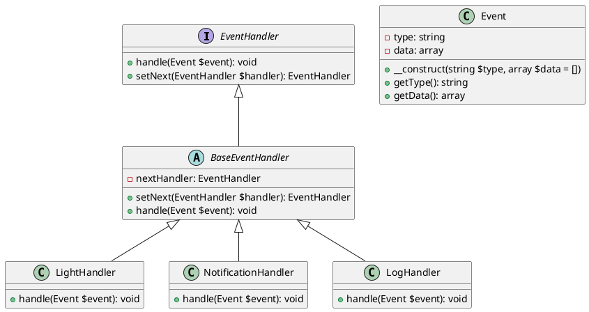

# PHP

Представьте, что мы работаем в компании, которая разрабатывает системы мониторинга и управления умным домом. Наша задача — обрабатывать события, которые происходят в реальном времени, такие как открытие двери, включение света или изменение температуры. Мы хотим, чтобы каждое событие проходило через цепочку обработчиков, которые могут реагировать на него по-разному. Например, если дверь открывается, мы можем захотеть включить свет, отправить уведомление на телефон и записать это событие в журнал.

#### Описание паттерна Цепочка обязанностей

Паттерн Цепочка обязанностей (Chain of Responsibility) позволяет передавать запросы последовательно по цепочке обработчиков. Каждый обработчик решает, может ли он обработать запрос сам или передать его дальше по цепочке. Этот паттерн особенно полезен, когда у нас есть несколько обработчиков, которые могут реагировать на одно и то же событие.

### Пример кода на PHP

**1. Создание интерфейса обработчика**


```php
<?php
interface EventHandler {
    public function handle(Event $event): void;
    public function setNext(EventHandler $handler): EventHandler;
}
```


**2. Создание базового класса обработчика**


```php
<?php
abstract class BaseEventHandler implements EventHandler {
    private ?EventHandler $nextHandler = null;

    public function setNext(EventHandler $handler): EventHandler {
        $this->nextHandler = $handler;
        return $handler;
    }

    public function handle(Event $event): void {
        if ($this->nextHandler) {
            $this->nextHandler->handle($event);
        }
    }
}
```


**3. Создание класса события**


```php
<?php
class Event {
    private string $type;
    private array $data;

    public function __construct(string $type, array $data = []) {
        $this->type = $type;
        $this->data = $data;
    }

    public function getType(): string {
        return $this->type;
    }

    public function getData(): array {
        return $this->data;
    }
}
```


**4. Создание конкретных обработчиков**


```php
<?php
class LightHandler extends BaseEventHandler {
    public function handle(Event $event): void {
        if ($event->getType() === 'door_open') {
            echo "Turning on the light.\n";
        }
        parent::handle($event);
    }
}

class NotificationHandler extends BaseEventHandler {
    public function handle(Event $event): void {
        if ($event->getType() === 'door_open') {
            echo "Sending notification to the phone.\n";
        }
        parent::handle($event);
    }
}

class LogHandler extends BaseEventHandler {
    public function handle(Event $event): void {
        echo "Logging event: " . $event->getType() . "\n";
        parent::handle($event);
    }
}
```


**5. Создание цепочки обработчиков и обработка события**


```php
<?php
$lightHandler = new LightHandler();
$notificationHandler = new NotificationHandler();
$logHandler = new LogHandler();

$lightHandler->setNext($notificationHandler)->setNext($logHandler);

$event = new Event('door_open');
$lightHandler->handle($event);
```


### UML диаграмма

<figure><figcaption><p>UML диаграмма для паттерна "Цепочка обязанностей"</p></figcaption></figure>





#### Вывод

Мы создали систему обработки событий в реальном времени, используя паттерн Цепочка обязанностей. Каждый обработчик может реагировать на событие по-своему или передавать его дальше по цепочке. Это позволяет нам гибко добавлять новые обработчики и изменять порядок их выполнения без изменения существующего кода. Такой подход делает систему более модульной и легко расширяемой.
