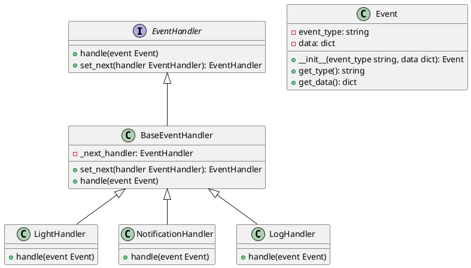

# Python

#### Вводная часть

Представьте, что мы работаем в компании, которая разрабатывает системы мониторинга и управления умным домом. Наша задача — обрабатывать события, которые происходят в реальном времени, такие как открытие двери, включение света или изменение температуры. Мы хотим, чтобы каждое событие проходило через цепочку обработчиков, которые могут реагировать на него по-разному. Например, если дверь открывается, мы можем захотеть включить свет, отправить уведомление на телефон и записать это событие в журнал.

### Описание паттерна

Паттерн Цепочка обязанностей (Chain of Responsibility) позволяет передавать запросы последовательно по цепочке обработчиков. Каждый обработчик решает, может ли он обработать запрос сам или передать его дальше по цепочке. Этот паттерн особенно полезен, когда у нас есть несколько обработчиков, которые могут реагировать на одно и то же событие.

### Пример кода на Python

**1. Создание интерфейса обработчика**


```python
from abc import ABC, abstractmethod

class EventHandler(ABC):
    @abstractmethod
    def handle(self, event):
        pass

    @abstractmethod
    def set_next(self, handler):
        pass
```


**2. Создание базового класса обработчика**


```python
class BaseEventHandler(EventHandler):
    def __init__(self):
        self._next_handler = None

    def set_next(self, handler):
        self._next_handler = handler
        return handler

    def handle(self, event):
        if self._next_handler:
            self._next_handler.handle(event)
```


**3. Создание класса события**


```python
class Event:
    def __init__(self, event_type, data=None):
        self.event_type = event_type
        self.data = data if data is not None else {}

    def get_type(self):
        return self.event_type

    def get_data(self):
        return self.data
```


**4. Создание конкретных обработчиков**


```python
class LightHandler(BaseEventHandler):
    def handle(self, event):
        if event.get_type() == 'door_open':
            print("Turning on the light.")
        super().handle(event)

class NotificationHandler(BaseEventHandler):
    def handle(self, event):
        if event.get_type() == 'door_open':
            print("Sending notification to the phone.")
        super().handle(event)

class LogHandler(BaseEventHandler):
    def handle(self, event):
        print(f"Logging event: {event.get_type()}")
        super().handle(event)
```


**5. Создание цепочки обработчиков и обработка события**


```python
if __name__ == "__main__":
    light_handler = LightHandler()
    notification_handler = NotificationHandler()
    log_handler = LogHandler()

    light_handler.set_next(notification_handler).set_next(log_handler)

    event = Event('door_open')
    light_handler.handle(event)
```


#### UML диаграмма

<figure><figcaption><p>UML диаграмма для паттерна "Цепочка обязанностей"</p></figcaption></figure>





### Вывод

Мы создали систему обработки событий в реальном времени, используя паттерн Цепочка обязанностей. Каждый обработчик может реагировать на событие по-своему или передавать его дальше по цепочке. Это позволяет нам гибко добавлять новые обработчики и изменять порядок их выполнения без изменения существующего кода. Такой подход делает систему более модульной и легко расширяемой.
