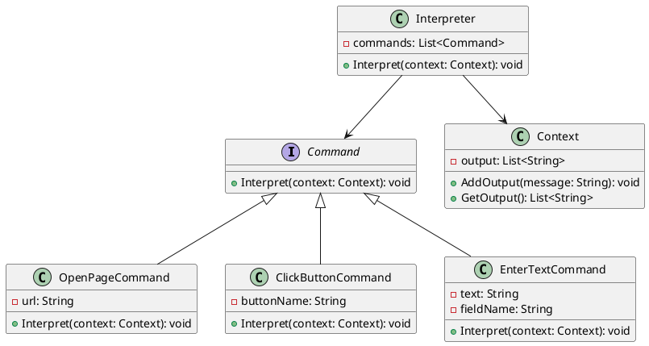

# Go

Представьте, что мы — команда разработчиков, работающих над созданием системы автоматического тестирования. Наша задача — разработать инструмент, который позволит пользователям задавать сценарии тестирования в простом и понятном формате. Эти сценарии должны быть интерпретированы и выполнены нашей системой.

### Описание кейса

Наша система должна уметь интерпретировать пользовательские сценарии тестирования, записанные в виде текстовых команд. Например, пользователь может задать сценарий в виде:

```
открыть страницу http://example.com
нажать кнопку "Войти"
ввести текст "username" в поле "Имя пользователя"
ввести текст "password" в поле "Пароль"
нажать кнопку "Отправить"
```

Для решения этой задачи мы будем использовать паттерн проектирования "Интерпретатор". Этот паттерн позволяет определить представление грамматики для заданного языка и интерпретировать предложения этого языка.

### Применение паттерна

Паттерн "Интерпретатор" поможет нам создать структуру, которая будет разбирать и выполнять команды из пользовательских сценариев. Мы создадим абстрактные классы для команд и конкретные классы для каждой команды (открыть страницу, нажать кнопку, ввести текст и т.д.).

### Пример кода на Go

**Абстрактный интерфейс команды**


```go
package main

import "fmt"

type Command interface {
    Interpret(context *Context)
}
```


**Контекст**


```go
package main

type Context struct {
    Output []string
}

func (c *Context) AddOutput(message string) {
    c.Output = append(c.Output, message)
}

func (c *Context) GetOutput() []string {
    return c.Output
}
```


**Конкретные команды**


```go
package main

type OpenPageCommand struct {
    Url string
}

func (c *OpenPageCommand) Interpret(context *Context) {
    context.AddOutput("Открываю страницу: " + c.Url)
}

type ClickButtonCommand struct {
    ButtonName string
}

func (c *ClickButtonCommand) Interpret(context *Context) {
    context.AddOutput("Нажимаю кнопку: " + c.ButtonName)
}

type EnterTextCommand struct {
    Text     string
    FieldName string
}

func (c *EnterTextCommand) Interpret(context *Context) {
    context.AddOutput("Ввожу текст '" + c.Text + "' в поле '" + c.FieldName + "'")
}
```


**Интерпретатор**


```go
package main

type Interpreter struct {
    Commands []Command
}

func (i *Interpreter) Interpret(context *Context) {
    for _, command := range i.Commands {
        command.Interpret(context)
    }
}
```


**Пример использования**


```go
package main

func main() {
    context := &Context{}

    commands := []Command{
        &OpenPageCommand{Url: "http://example.com"},
        &ClickButtonCommand{ButtonName: "Войти"},
        &EnterTextCommand{Text: "username", FieldName: "Имя пользователя"},
        &EnterTextCommand{Text: "password", FieldName: "Пароль"},
        &ClickButtonCommand{ButtonName: "Отправить"},
    }

    interpreter := &Interpreter{Commands: commands}
    interpreter.Interpret(context)

    for _, output := range context.GetOutput() {
        fmt.Println(output)
    }
}
```


#### UML диаграмма

<figure><figcaption><p>UML диаграмма для паттерна "Интерпретатор"</p></figcaption></figure>





### Вывод для кейса

Использование паттерна "Интерпретатор" позволило нам создать гибкую и расширяемую систему для интерпретации пользовательских сценариев тестирования. Мы определили абстрактный интерфейс команды и конкретные классы для каждой команды, что позволяет легко добавлять новые команды в будущем. Контекст хранит результаты выполнения команд, а интерпретатор управляет процессом выполнения сценария. Этот подход делает систему более модульной и удобной для поддержки.
