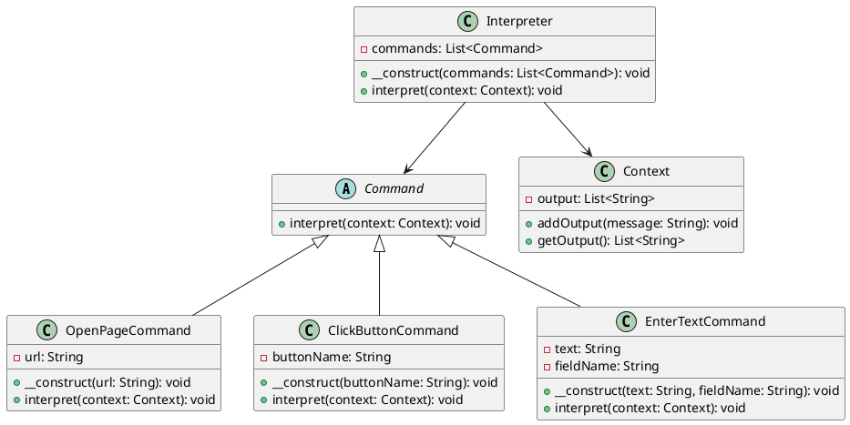

# PHP

Представьте, что мы — команда разработчиков, работающих над созданием системы автоматического тестирования. Наша задача — разработать инструмент, который позволит пользователям задавать сценарии тестирования в простом и понятном формате. Эти сценарии должны быть интерпретированы и выполнены нашей системой.

#### Описание кейса

Наша система должна уметь интерпретировать пользовательские сценарии тестирования, записанные в виде текстовых команд. Например, пользователь может задать сценарий в виде:

```
открыть страницу http://example.com
нажать кнопку "Войти"
ввести текст "username" в поле "Имя пользователя"
ввести текст "password" в поле "Пароль"
нажать кнопку "Отправить"
```

Для решения этой задачи мы будем использовать паттерн проектирования "Интерпретатор". Этот паттерн позволяет определить представление грамматики для заданного языка и интерпретировать предложения этого языка.

### Применение паттерна

Паттерн "Интерпретатор" поможет нам создать структуру, которая будет разбирать и выполнять команды из пользовательских сценариев. Мы создадим абстрактные классы для команд и конкретные классы для каждой команды (открыть страницу, нажать кнопку, ввести текст и т.д.).

### Пример кода на PHP

**Абстрактный класс команды**


```php
abstract class Command {
    abstract public function interpret(Context $context);
}
```


**Контекст**


```php
class Context {
    private $output;

    public function __construct() {
        $this->output = [];
    }

    public function addOutput($message) {
        $this->output[] = $message;
    }

    public function getOutput() {
        return $this->output;
    }
}
```


**Конкретные команды**


```php
class OpenPageCommand extends Command {
    private $url;

    public function __construct($url) {
        $this->url = $url;
    }

    public function interpret(Context $context) {
        $context->addOutput("Открываю страницу: " . $this->url);
    }
}

class ClickButtonCommand extends Command {
    private $buttonName;

    public function __construct($buttonName) {
        $this->buttonName = $buttonName;
    }

    public function interpret(Context $context) {
        $context->addOutput("Нажимаю кнопку: " . $this->buttonName);
    }
}

class EnterTextCommand extends Command {
    private $text;
    private $fieldName;

    public function __construct($text, $fieldName) {
        $this->text = $text;
        $this->fieldName = $fieldName;
    }

    public function interpret(Context $context) {
        $context->addOutput("Ввожу текст '" . $this->text . "' в поле '" . $this->fieldName . "'");
    }
}
```


**Интерпретатор**


```php
class Interpreter {
    private $commands;

    public function __construct($commands) {
        $this->commands = $commands;
    }

    public function interpret(Context $context) {
        foreach ($this->commands as $command) {
            $command->interpret($context);
        }
    }
}
```


### **Пример использования**


```php
$context = new Context();

$commands = [
    new OpenPageCommand("http://example.com"),
    new ClickButtonCommand("Войти"),
    new EnterTextCommand("username", "Имя пользователя"),
    new EnterTextCommand("password", "Пароль"),
    new ClickButtonCommand("Отправить")
];

$interpreter = new Interpreter($commands);
$interpreter->interpret($context);

print_r($context->getOutput());
```


#### UML диаграмма

<figure><figcaption><p>UML диаграмма для паттерна "Интерпретатор"</p></figcaption></figure>





### Вывод для кейса

Использование паттерна "Интерпретатор" позволило нам создать гибкую и расширяемую систему для интерпретации пользовательских сценариев тестирования. Мы определили абстрактный класс команды и конкретные классы для каждой команды, что позволяет легко добавлять новые команды в будущем. Контекст хранит результаты выполнения команд, а интерпретатор управляет процессом выполнения сценария. Этот подход делает систему более модульной и удобной для поддержки.
