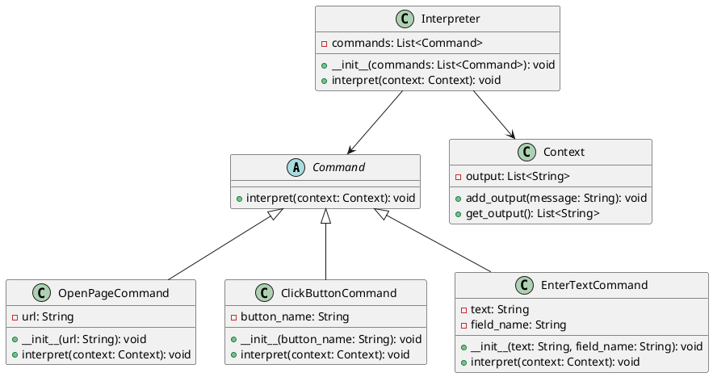

# Python

Представьте, что мы — команда разработчиков, работающих над созданием системы автоматического тестирования. Наша задача — разработать инструмент, который позволит пользователям задавать сценарии тестирования в простом и понятном формате. Эти сценарии должны быть интерпретированы и выполнены нашей системой.

### Описание кейса

Наша система должна уметь интерпретировать пользовательские сценарии тестирования, записанные в виде текстовых команд. Например, пользователь может задать сценарий в виде:

```
открыть страницу http://example.com
нажать кнопку "Войти"
ввести текст "username" в поле "Имя пользователя"
ввести текст "password" в поле "Пароль"
нажать кнопку "Отправить"
```

Для решения этой задачи мы будем использовать паттерн проектирования "Интерпретатор". Этот паттерн позволяет определить представление грамматики для заданного языка и интерпретировать предложения этого языка.

### Применение паттерна

Паттерн "Интерпретатор" поможет нам создать структуру, которая будет разбирать и выполнять команды из пользовательских сценариев. Мы создадим абстрактные классы для команд и конкретные классы для каждой команды (открыть страницу, нажать кнопку, ввести текст и т.д.).

#### Пример кода на Python

**Абстрактный класс команды**


```python
from abc import ABC, abstractmethod

class Command(ABC):
    @abstractmethod
    def interpret(self, context):
        pass
```


**Контекст**


```python
class Context:
    def __init__(self):
        self.output = []

    def add_output(self, message):
        self.output.append(message)

    def get_output(self):
        return self.output
```


**Конкретные команды**


```python
class OpenPageCommand(Command):
    def __init__(self, url):
        self.url = url

    def interpret(self, context):
        context.add_output(f"Открываю страницу: {self.url}")

class ClickButtonCommand(Command):
    def __init__(self, button_name):
        self.button_name = button_name

    def interpret(self, context):
        context.add_output(f"Нажимаю кнопку: {self.button_name}")

class EnterTextCommand(Command):
    def __init__(self, text, field_name):
        self.text = text
        self.field_name = field_name

    def interpret(self, context):
        context.add_output(f"Ввожу текст '{self.text}' в поле '{self.field_name}'")
```


**Интерпретатор**


```python
class Interpreter:
    def __init__(self, commands):
        self.commands = commands

    def interpret(self, context):
        for command in self.commands:
            command.interpret(context)
```


### **Пример использования**


```python
if __name__ == "__main__":
    context = Context()

    commands = [
        OpenPageCommand("http://example.com"),
        ClickButtonCommand("Войти"),
        EnterTextCommand("username", "Имя пользователя"),
        EnterTextCommand("password", "Пароль"),
        ClickButtonCommand("Отправить")
    ]

    interpreter = Interpreter(commands)
    interpreter.interpret(context)

    for output in context.get_output():
        print(output)
```


### UML диаграмма

<figure><figcaption><p>UML диаграмма для паттерна "Интерпретатор"</p></figcaption></figure>





### Вывод для кейса

Использование паттерна "Интерпретатор" позволило нам создать гибкую и расширяемую систему для интерпретации пользовательских сценариев тестирования. Мы определили абстрактный класс команды и конкретные классы для каждой команды, что позволяет легко добавлять новые команды в будущем. Контекст хранит результаты выполнения команд, а интерпретатор управляет процессом выполнения сценария. Этот подход делает систему более модульной и удобной для поддержки.
