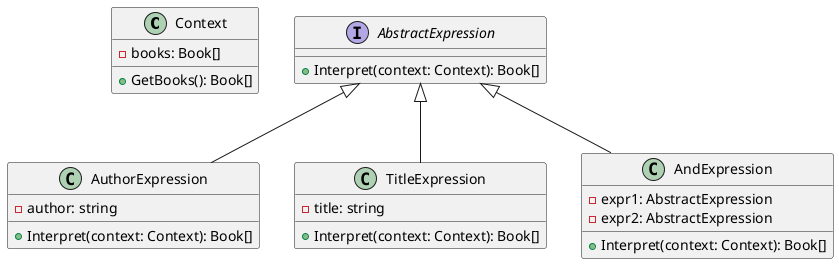

# Go

Представьте, что мы разрабатываем веб-приложение для управления библиотекой. Наше приложение позволяет пользователям искать книги по различным критериям, таким как автор, название, год издания и т.д. Мы хотим сделать так, чтобы пользователи могли создавать сложные запросы, комбинируя различные условия. Для этого мы будем использовать паттерн "Интерпретатор".

### **Описание кейса**

Наше приложение должно позволять пользователям создавать запросы в виде текстовых выражений, например:

* "Автор: Толстой И Название: Война и мир"
* "Год: 2020 И Жанр: Фантастика"

Мы будем использовать паттерн "Интерпретатор" для интерпретации и выполнения этих запросов.

### Пример кода на Go

**Шаг 1: Создание контекста**

Контекст будет содержать информацию о доступных книгах и методы для получения этой информации.


```go
package main

import "fmt"

type Book struct {
    Title  string
    Author string
    Year   int
    Genre  string
}

type Context struct {
    Books []Book
}

func (c *Context) GetBooks() []Book {
    return c.Books
}
```


**Шаг 2: Создание абстрактного выражения**

Абстрактное выражение будет содержать метод `Interpret`, который будет реализован в конкретных выражениях.


```go
type AbstractExpression interface {
    Interpret(context *Context) []Book
}
```


**Шаг 3: Создание конечных выражений**

Конечные выражения будут реализовывать метод `Interpret` для конкретных условий.


```go
type AuthorExpression struct {
    Author string
}

func (e *AuthorExpression) Interpret(context *Context) []Book {
    books := context.GetBooks()
    var result []Book
    for _, book := range books {
        if book.Author == e.Author {
            result = append(result, book)
        }
    }
    return result
}

type TitleExpression struct {
    Title string
}

func (e *TitleExpression) Interpret(context *Context) []Book {
    books := context.GetBooks()
    var result []Book
    for _, book := range books {
        if book.Title == e.Title {
            result = append(result, book)
        }
    }
    return result
}
```


**Шаг 4: Создание неконечных выражений**

Неконечные выражения будут комбинировать другие выражения.


```go
type AndExpression struct {
    Expr1 AbstractExpression
    Expr2 AbstractExpression
}

func (e *AndExpression) Interpret(context *Context) []Book {
    result1 := e.Expr1.Interpret(context)
    result2 := e.Expr2.Interpret(context)
    var result []Book
    for _, book1 := range result1 {
        for _, book2 := range result2 {
            if book1 == book2 {
                result = append(result, book1)
                break
            }
        }
    }
    return result
}
```


**Шаг 5: Использование интерпретатора**

Теперь мы можем использовать наш интерпретатор для выполнения запросов.


```go
func main() {
    // Пример данных
    books := []Book{
        {Title: "Война и мир", Author: "Толстой", Year: 1869, Genre: "Роман"},
        {Title: "1984", Author: "Оруэлл", Year: 1949, Genre: "Фантастика"},
        {Title: "Дюна", Author: "Герберт", Year: 1965, Genre: "Фантастика"},
    }

    context := &Context{Books: books}

    // Создание запроса
    authorExpr := &AuthorExpression{Author: "Толстой"}
    titleExpr := &TitleExpression{Title: "Война и мир"}
    andExpr := &AndExpression{Expr1: authorExpr, Expr2: titleExpr}

    // Интерпретация запроса
    result := andExpr.Interpret(context)

    fmt.Println(result)
}
```


### UML диаграмма

<figure><figcaption><p>UML диаграмма для паттерна "Интерпретатор"</p></figcaption></figure>





### Вывод

В этом кейсе мы рассмотрели, как можно использовать паттерн "Интерпретатор" для создания системы, которая позволяет пользователям создавать и выполнять сложные запросы к базе данных книг. Мы создали контекст, абстрактное выражение, конечные выражения и неконечные выражения. Затем мы использовали эти компоненты для интерпретации и выполнения запросов.

Паттерн "Интерпретатор" позволяет гибко и удобно обрабатывать сложные запросы, разделяя грамматику языка от его интерпретации. Это делает код более чистым и управляемым, особенно когда речь идет о сложных условиях и правилах.
