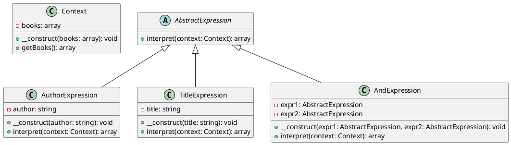

# PHP

Представьте, что мы разрабатываем веб-приложение для управления библиотекой. Наше приложение позволяет пользователям искать книги по различным критериям, таким как автор, название, год издания и т.д. Мы хотим сделать так, чтобы пользователи могли создавать сложные запросы, комбинируя различные условия. Для этого мы будем использовать паттерн "Интерпретатор".

### **Описание кейса**

Наше приложение должно позволять пользователям создавать запросы в виде текстовых выражений, например:

* "Автор: Толстой И Название: Война и мир"
* "Год: 2020 И Жанр: Фантастика"

Мы будем использовать паттерн "Интерпретатор" для интерпретации и выполнения этих запросов.

### Пример кода на PHP

**Шаг 1: Создание контекста**

Контекст будет содержать информацию о доступных книгах и методы для получения этой информации.


```php
class Context {
    private $books;

    public function __construct($books) {
        $this->books = $books;
    }

    public function getBooks() {
        return $this->books;
    }
}
```


**Шаг 2: Создание абстрактного выражения**

Абстрактное выражение будет содержать метод `interpret`, который будет реализован в конкретных выражениях.


```php
abstract class AbstractExpression {
    abstract public function interpret(Context $context);
}
```


**Шаг 3: Создание конечных выражений**

Конечные выражения будут реализовывать метод `interpret` для конкретных условий.


```php
class AuthorExpression extends AbstractExpression {
    private $author;

    public function __construct($author) {
        $this->author = $author;
    }

    public function interpret(Context $context) {
        $books = $context->getBooks();
        return array_filter($books, function($book) {
            return $book['author'] === $this->author;
        });
    }
}

class TitleExpression extends AbstractExpression {
    private $title;

    public function __construct($title) {
        $this->title = $title;
    }

    public function interpret(Context $context) {
        $books = $context->getBooks();
        return array_filter($books, function($book) {
            return $book['title'] === $this->title;
        });
    }
}
```


**Шаг 4: Создание неконечных выражений**

Неконечные выражения будут комбинировать другие выражения.


```php
class AndExpression extends AbstractExpression {
    private $expr1;
    private $expr2;

    public function __construct(AbstractExpression $expr1, AbstractExpression $expr2) {
        $this->expr1 = $expr1;
        $this->expr2 = $expr2;
    }

    public function interpret(Context $context) {
        $result1 = $this->expr1->interpret($context);
        $result2 = $this->expr2->interpret($context);
        return array_intersect_key($result1, $result2);
    }
}
```


**Шаг 5: Использование интерпретатора**

Теперь мы можем использовать наш интерпретатор для выполнения запросов.


```php
// Пример данных
$books = [
    ['title' => 'Война и мир', 'author' => 'Толстой', 'year' => 1869, 'genre' => 'Роман'],
    ['title' => '1984', 'author' => 'Оруэлл', 'year' => 1949, 'genre' => 'Фантастика'],
    ['title' => 'Дюна', 'author' => 'Герберт', 'year' => 1965, 'genre' => 'Фантастика'],
];

$context = new Context($books);

// Создание запроса
$authorExpr = new AuthorExpression('Толстой');
$titleExpr = new TitleExpression('Война и мир');
$andExpr = new AndExpression($authorExpr, $titleExpr);

// Интерпретация запроса
$result = $andExpr->interpret($context);

print_r($result);
```


### UML диаграмма

<figure><figcaption><p>UML диаграмма для паттерна "Интерпретатор"</p></figcaption></figure>





### Вывод

В этом кейсе мы рассмотрели, как можно использовать паттерн "Интерпретатор" для создания системы, которая позволяет пользователям создавать и выполнять сложные запросы к базе данных книг. Мы создали контекст, абстрактное выражение, конечные выражения и неконечные выражения. Затем мы использовали эти компоненты для интерпретации и выполнения запросов.

Паттерн "Интерпретатор" позволяет гибко и удобно обрабатывать сложные запросы, разделяя грамматику языка от его интерпретации. Это делает код более чистым и управляемым, особенно когда речь идет о сложных условиях и правилах.
