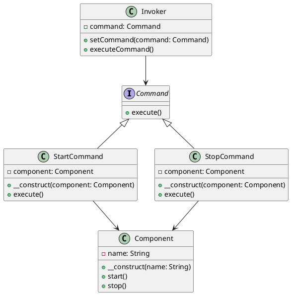

# PHP

Представьте, что мы разрабатываем приложение для управления состоянием различных компонентов системы. Наше приложение должно уметь включать и выключать различные компоненты, такие как серверы, базы данных и другие сервисы. Мы хотим, чтобы наше приложение было гибким и легко расширяемым, чтобы в будущем можно было добавлять новые команды без изменения существующего кода.

Для этого мы будем использовать паттерн проектирования "Команда" (Command). Этот паттерн позволяет инкапсулировать запрос как объект, что позволяет параметризовать клиентов с различными запросами, очередями или логированием запросов, а также поддерживать отмену операций.

### Описание кейса

Мы создадим систему управления состоянием приложения, которая будет включать и выключать компоненты. Мы будем использовать паттерн "Команда" для инкапсуляции команд включения и выключения.

### Пример кода на PHP

**1. Создание интерфейса команды**


```php
<?php
interface Command {
    public function execute();
}
```


**2. Создание конкретных команд**


```php
<?php
class StartCommand implements Command {
    private $component;

    public function __construct($component) {
        $this->component = $component;
    }

    public function execute() {
        $this->component->start();
    }
}

class StopCommand implements Command {
    private $component;

    public function __construct($component) {
        $this->component = $component;
    }

    public function execute() {
        $this->component->stop();
    }
}
```


**3. Создание получателя команд**


```php
<?php
class Component {
    private $name;

    public function __construct($name) {
        $this->name = $name;
    }

    public function start() {
        echo "Компонент {$this->name} запущен.\n";
    }

    public function stop() {
        echo "Компонент {$this->name} остановлен.\n";
    }
}
```


**4. Создание отправителя команд**


```php
<?php
class Invoker {
    private $command;

    public function setCommand(Command $command) {
        $this->command = $command;
    }

    public function executeCommand() {
        $this->command->execute();
    }
}
```


**5. Пример использования**


```php
<?php
// Создаем компонент
$component = new Component('Сервер');

// Создаем команды
$startCommand = new StartCommand($component);
$stopCommand = new StopCommand($component);

// Создаем отправителя команд
$invoker = new Invoker();

// Устанавливаем и выполняем команду запуска
$invoker->setCommand($startCommand);
$invoker->executeCommand();

// Устанавливаем и выполняем команду остановки
$invoker->setCommand($stopCommand);
$invoker->executeCommand();
```


### UML диаграмма

<figure><figcaption><p>UML диаграмма для паттерна "Команда"</p></figcaption></figure>





### Вывод для кейса

Использование паттерна "Команда" позволяет нам гибко управлять состоянием компонентов нашего приложения. Мы можем легко добавлять новые команды, не изменяя существующий код. Это делает наше приложение более гибким и расширяемым. В данном кейсе мы создали команды для запуска и остановки компонентов, а также отправителя команд, который может выполнять эти команды. Это позволяет нам легко управлять состоянием наших компонентов и добавлять новые команды в будущем.
