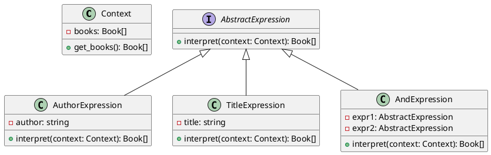

# Python

Представьте, что мы разрабатываем веб-приложение для управления библиотекой. Наше приложение позволяет пользователям искать книги по различным критериям, таким как автор, название, год издания и т.д. Мы хотим сделать так, чтобы пользователи могли создавать сложные запросы, комбинируя различные условия. Для этого мы будем использовать паттерн "Интерпретатор".

### **Описание кейса**

Наше приложение должно позволять пользователям создавать запросы в виде текстовых выражений, например:

* "Автор: Толстой И Название: Война и мир"
* "Год: 2020 И Жанр: Фантастика"

Мы будем использовать паттерн "Интерпретатор" для интерпретации и выполнения этих запросов.

### Пример кода на Python

**Шаг 1: Создание контекста**

Контекст будет содержать информацию о доступных книгах и методы для получения этой информации.


```python
class Book:
    def __init__(self, title, author, year, genre):
        self.title = title
        self.author = author
        self.year = year
        self.genre = genre

class Context:
    def __init__(self, books):
        self.books = books

    def get_books(self):
        return self.books
```


**Шаг 2: Создание абстрактного выражения**

Абстрактное выражение будет содержать метод `interpret`, который будет реализован в конкретных выражениях.


```python
from abc import ABC, abstractmethod

class AbstractExpression(ABC):
    @abstractmethod
    def interpret(self, context):
        pass
```


**Шаг 3: Создание конечных выражений**

Конечные выражения будут реализовывать метод `interpret` для конкретных условий.


```python
class AuthorExpression(AbstractExpression):
    def __init__(self, author):
        self.author = author

    def interpret(self, context):
        books = context.get_books()
        return [book for book in books if book.author == self.author]

class TitleExpression(AbstractExpression):
    def __init__(self, title):
        self.title = title

    def interpret(self, context):
        books = context.get_books()
        return [book for book in books if book.title == self.title]
```


**Шаг 4: Создание неконечных выражений**

Неконечные выражения будут комбинировать другие выражения.


```python
class AndExpression(AbstractExpression):
    def __init__(self, expr1, expr2):
        self.expr1 = expr1
        self.expr2 = expr2

    def interpret(self, context):
        result1 = self.expr1.interpret(context)
        result2 = self.expr2.interpret(context)
        return [book for book in result1 if book in result2]
```


**Шаг 5: Использование интерпретатора**

Теперь мы можем использовать наш интерпретатор для выполнения запросов.


```python
def main():
    # Пример данных
    books = [
        Book(title="Война и мир", author="Толстой", year=1869, genre="Роман"),
        Book(title="1984", author="Оруэлл", year=1949, genre="Фантастика"),
        Book(title="Дюна", author="Герберт", year=1965, genre="Фантастика"),
    ]

    context = Context(books)

    # Создание запроса
    author_expr = AuthorExpression(author="Толстой")
    title_expr = TitleExpression(title="Война и мир")
    and_expr = AndExpression(expr1=author_expr, expr2=title_expr)

    # Интерпретация запроса
    result = and_expr.interpret(context)

    for book in result:
        print(f"Title: {book.title}, Author: {book.author}, Year: {book.year}, Genre: {book.genre}")

if __name__ == "__main__":
    main()
```


### UML диаграмма

<figure><figcaption><p>UML диаграмма для паттерна "Интерпретатор"</p></figcaption></figure>





### Вывод

В этом кейсе мы рассмотрели, как можно использовать паттерн "Интерпретатор" для создания системы, которая позволяет пользователям создавать и выполнять сложные запросы к базе данных книг. Мы создали контекст, абстрактное выражение, конечные выражения и неконечные выражения. Затем мы использовали эти компоненты для интерпретации и выполнения запросов.

Паттерн "Интерпретатор" позволяет гибко и удобно обрабатывать сложные запросы, разделяя грамматику языка от его интерпретации. Это делает код более чистым и управляемым, особенно когда речь идет о сложных условиях и правилах.
