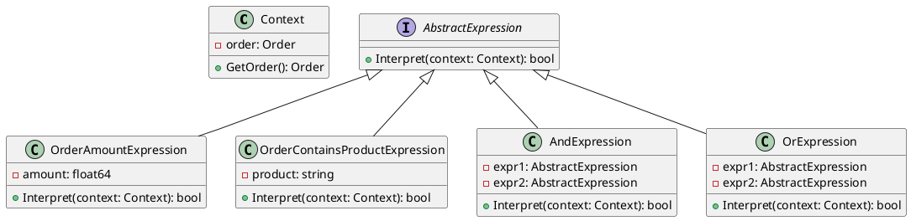

# Go

Представьте, что мы разрабатываем систему управления заказами для интернет-магазина. Наша система должна позволять администраторам задавать правила бизнес-логики для обработки заказов. Например, если сумма заказа превышает определенную величину, то применяется скидка, или если заказ содержит определенные товары, то применяется бесплатная доставка.

Для реализации этой функциональности мы будем использовать паттерн "Интерпретатор". Этот паттерн позволяет нам создать язык для описания правил бизнес-логики и интерпретатор для их выполнения.

### Пример кода на Go

**Шаг 1: Создание контекста**

Контекст будет содержать информацию о текущем заказе и методы для получения этой информации.


```go
package main

import "fmt"

type Order struct {
    TotalAmount float64
    Products    []string
}

type Context struct {
    Order Order
}

func (c *Context) GetOrder() Order {
    return c.Order
}
```


**Шаг 2: Создание абстрактного выражения**

Абстрактное выражение будет содержать метод `Interpret`, который будет реализован в конкретных выражениях.


```go
type AbstractExpression interface {
    Interpret(context *Context) bool
}
```


**Шаг 3: Создание конечных выражений**

Конечные выражения будут реализовывать метод `Interpret` для конкретных условий.


```go
type OrderAmountExpression struct {
    Amount float64
}

func (e *OrderAmountExpression) Interpret(context *Context) bool {
    order := context.GetOrder()
    return order.TotalAmount > e.Amount
}

type OrderContainsProductExpression struct {
    Product string
}

func (e *OrderContainsProductExpression) Interpret(context *Context) bool {
    order := context.GetOrder()
    for _, product := range order.Products {
        if product == e.Product {
            return true
        }
    }
    return false
}
```


**Шаг 4: Создание неконечных выражений**

Неконечные выражения будут комбинировать другие выражения.


```go
type AndExpression struct {
    Expr1 AbstractExpression
    Expr2 AbstractExpression
}

func (e *AndExpression) Interpret(context *Context) bool {
    return e.Expr1.Interpret(context) && e.Expr2.Interpret(context)
}

type OrExpression struct {
    Expr1 AbstractExpression
    Expr2 AbstractExpression
}

func (e *OrExpression) Interpret(context *Context) bool {
    return e.Expr1.Interpret(context) || e.Expr2.Interpret(context)
}
```


**Шаг 5: Использование интерпретатора**

Теперь мы можем использовать наш интерпретатор для выполнения правил бизнес-логики.


```go
func main() {
    // Пример данных
    order := Order{
        TotalAmount: 200,
        Products:    []string{"product1", "product2"},
    }

    context := &Context{Order: order}

    // Создание правил
    amountExpr := &OrderAmountExpression{Amount: 100}
    productExpr := &OrderContainsProductExpression{Product: "product1"}
    andExpr := &AndExpression{Expr1: amountExpr, Expr2: productExpr}

    // Интерпретация правил
    result := andExpr.Interpret(context)

    if result {
        fmt.Println("Правила выполнены: применяется скидка или бесплатная доставка.")
    } else {
        fmt.Println("Правила не выполнены.")
    }
}
```


### UML диаграмма

<figure><figcaption><p>UML диаграмма для паттерна "Интерпретатор"</p></figcaption></figure>





### Вывод

В этом кейсе мы рассмотрели, как можно использовать паттерн "Интерпретатор" для создания системы, которая позволяет администраторам задавать правила бизнес-логики для обработки заказов. Мы создали контекст, абстрактное выражение, конечные выражения и неконечные выражения. Затем мы использовали эти компоненты для интерпретации и выполнения правил бизнес-логики.

Паттерн "Интерпретатор" позволяет гибко и удобно обрабатывать сложные правила, разделяя грамматику языка от его интерпретации. Это делает код более чистым и управляемым, особенно когда речь идет о сложных условиях и правилах.
