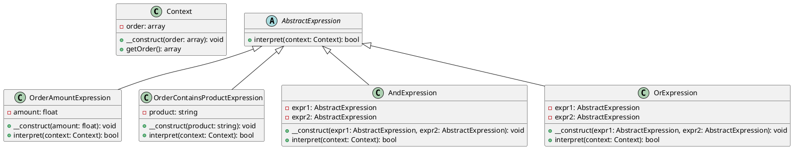

# PHP

Представьте, что мы разрабатываем систему управления заказами для интернет-магазина. Наша система должна позволять администраторам задавать правила бизнес-логики для обработки заказов. Например, если сумма заказа превышает определенную величину, то применяется скидка, или если заказ содержит определенные товары, то применяется бесплатная доставка.

Для реализации этой функциональности мы будем использовать паттерн "Интерпретатор". Этот паттерн позволяет нам создать язык для описания правил бизнес-логики и интерпретатор для их выполнения.

### Пример кода на PHP

**Шаг 1: Создание контекста**

Контекст будет содержать информацию о текущем заказе и методы для получения этой информации.


```php
class Context {
    private $order;

    public function __construct($order) {
        $this->order = $order;
    }

    public function getOrder() {
        return $this->order;
    }
}
```


**Шаг 2: Создание абстрактного выражения**

Абстрактное выражение будет содержать метод `interpret`, который будет реализован в конкретных выражениях.


```php
abstract class AbstractExpression {
    abstract public function interpret(Context $context);
}
```


**Шаг 3: Создание конечных выражений**

Конечные выражения будут реализовывать метод `interpret` для конкретных условий.


```php
class OrderAmountExpression extends AbstractExpression {
    private $amount;

    public function __construct($amount) {
        $this->amount = $amount;
    }

    public function interpret(Context $context) {
        $order = $context->getOrder();
        return $order['totalAmount'] > $this->amount;
    }
}

class OrderContainsProductExpression extends AbstractExpression {
    private $product;

    public function __construct($product) {
        $this->product = $product;
    }

    public function interpret(Context $context) {
        $order = $context->getOrder();
        return in_array($this->product, $order['products']);
    }
}
```


**Шаг 4: Создание неконечных выражений**

Неконечные выражения будут комбинировать другие выражения.


```php
class AndExpression extends AbstractExpression {
    private $expr1;
    private $expr2;

    public function __construct(AbstractExpression $expr1, AbstractExpression $expr2) {
        $this->expr1 = $expr1;
        $this->expr2 = $expr2;
    }

    public function interpret(Context $context) {
        return $this->expr1->interpret($context) && $this->expr2->interpret($context);
    }
}

class OrExpression extends AbstractExpression {
    private $expr1;
    private $expr2;

    public function __construct(AbstractExpression $expr1, AbstractExpression $expr2) {
        $this->expr1 = $expr1;
        $this->expr2 = $expr2;
    }

    public function interpret(Context $context) {
        return $this->expr1->interpret($context) || $this->expr2->interpret($context);
    }
}
```


**Шаг 5: Использование интерпретатора**

Теперь мы можем использовать наш интерпретатор для выполнения правил бизнес-логики.


```php
// Пример данных
$order = [
    'totalAmount' => 200,
    'products' => ['product1', 'product2']
];

$context = new Context($order);

// Создание правил
$amountExpr = new OrderAmountExpression(100);
$productExpr = new OrderContainsProductExpression('product1');
$andExpr = new AndExpression($amountExpr, $productExpr);

// Интерпретация правил
$result = $andExpr->interpret($context);

if ($result) {
    echo "Правила выполнены: применяется скидка или бесплатная доставка.";
} else {
    echo "Правила не выполнены.";
}
```


### UML диаграмма

<figure><figcaption><p>UML диаграмма для паттерна "Интерпретатор"</p></figcaption></figure>





### Вывод

В этом кейсе мы рассмотрели, как можно использовать паттерн "Интерпретатор" для создания системы, которая позволяет администраторам задавать правила бизнес-логики для обработки заказов. Мы создали контекст, абстрактное выражение, конечные выражения и неконечные выражения. Затем мы использовали эти компоненты для интерпретации и выполнения правил бизнес-логики.

Паттерн "Интерпретатор" позволяет гибко и удобно обрабатывать сложные правила, разделяя грамматику языка от его интерпретации. Это делает код более чистым и управляемым, особенно когда речь идет о сложных условиях и правилах.
