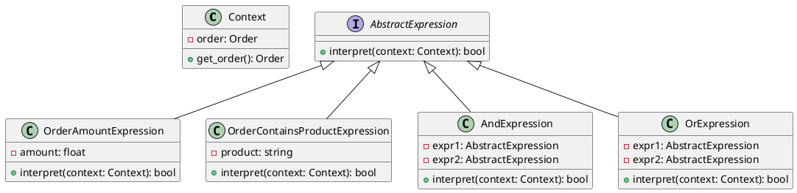

# Python

Представьте, что мы разрабатываем систему управления заказами для интернет-магазина. Наша система должна позволять администраторам задавать правила бизнес-логики для обработки заказов. Например, если сумма заказа превышает определенную величину, то применяется скидка, или если заказ содержит определенные товары, то применяется бесплатная доставка.

Для реализации этой функциональности мы будем использовать паттерн "Интерпретатор". Этот паттерн позволяет нам создать язык для описания правил бизнес-логики и интерпретатор для их выполнения.

### Пример кода на Python

**Шаг 1: Создание контекста**

Контекст будет содержать информацию о текущем заказе и методы для получения этой информации.


```python
class Order:
    def __init__(self, total_amount, products):
        self.total_amount = total_amount
        self.products = products

class Context:
    def __init__(self, order):
        self.order = order

    def get_order(self):
        return self.order
```


**Шаг 2: Создание абстрактного выражения**

Абстрактное выражение будет содержать метод `interpret`, который будет реализован в конкретных выражениях.


```python
from abc import ABC, abstractmethod

class AbstractExpression(ABC):
    @abstractmethod
    def interpret(self, context):
        pass
```


**Шаг 3: Создание конечных выражений**

Конечные выражения будут реализовывать метод `interpret` для конкретных условий.


```python
class OrderAmountExpression(AbstractExpression):
    def __init__(self, amount):
        self.amount = amount

    def interpret(self, context):
        order = context.get_order()
        return order.total_amount > self.amount

class OrderContainsProductExpression(AbstractExpression):
    def __init__(self, product):
        self.product = product

    def interpret(self, context):
        order = context.get_order()
        return self.product in order.products
```


**Шаг 4: Создание неконечных выражений**

Неконечные выражения будут комбинировать другие выражения.


```python
class AndExpression(AbstractExpression):
    def __init__(self, expr1, expr2):
        self.expr1 = expr1
        self.expr2 = expr2

    def interpret(self, context):
        return self.expr1.interpret(context) and self.expr2.interpret(context)

class OrExpression(AbstractExpression):
    def __init__(self, expr1, expr2):
        self.expr1 = expr1
        self.expr2 = expr2

    def interpret(self, context):
        return self.expr1.interpret(context) or self.expr2.interpret(context)
```


**Шаг 5: Использование интерпретатора**

Теперь мы можем использовать наш интерпретатор для выполнения правил бизнес-логики.


```python
def main():
    # Пример данных
    order = Order(total_amount=200, products=["product1", "product2"])
    context = Context(order)

    # Создание правил
    amount_expr = OrderAmountExpression(amount=100)
    product_expr = OrderContainsProductExpression(product="product1")
    and_expr = AndExpression(expr1=amount_expr, expr2=product_expr)

    # Интерпретация правил
    result = and_expr.interpret(context)

    if result:
        print("Правила выполнены: применяется скидка или бесплатная доставка.")
    else:
        print("Правила не выполнены.")

if __name__ == "__main__":
    main()
```


### UML диаграмма

<figure><figcaption><p>UML диаграмма для паттерна "Интерпретатор"</p></figcaption></figure>





### Вывод

В этом кейсе мы рассмотрели, как можно использовать паттерн "Интерпретатор" для создания системы, которая позволяет администраторам задавать правила бизнес-логики для обработки заказов. Мы создали контекст, абстрактное выражение, конечные выражения и неконечные выражения. Затем мы использовали эти компоненты для интерпретации и выполнения правил бизнес-логики.

Паттерн "Интерпретатор" позволяет гибко и удобно обрабатывать сложные правила, разделяя грамматику языка от его интерпретации. Это делает код более чистым и управляемым, особенно когда речь идет о сложных условиях и правилах.
