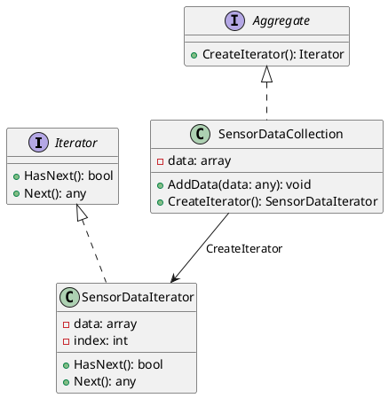

# Go

Мы работаем в компании, которая занимается анализом данных в реальном времени. Наша задача — создать систему, которая будет собирать данные с различных сенсоров и анализировать их. Мы хотим, чтобы наша система была гибкой и легко расширяемой, чтобы мы могли добавлять новые типы сенсоров и методы анализа данных без необходимости переписывать весь код.

### Описание кейса

Для решения этой задачи мы будем использовать паттерн проектирования "Итератор". Этот паттерн позволяет нам перебирать элементы коллекции без необходимости знать её внутреннюю структуру. В нашем случае, коллекцией будут данные, поступающие с сенсоров, а итератор будет использоваться для их последовательного анализа.

### Пример кода на Go

**Шаг 1: Определение интерфейса итератора**


```go
package main

import "fmt"

type Iterator interface {
    HasNext() bool
    Next() interface{}
}
```


**Шаг 2: Определение интерфейса коллекции**


```go
type Aggregate interface {
    CreateIterator() Iterator
}
```


**Шаг 3: Реализация коллекции данных сенсоров**


```go
type SensorDataCollection struct {
    data []interface{}
}

func (c *SensorDataCollection) AddData(data interface{}) {
    c.data = append(c.data, data)
}

func (c *SensorDataCollection) CreateIterator() Iterator {
    return &SensorDataIterator{data: c.data}
}
```


**Шаг 4: Реализация итератора для данных сенсоров**


```go
type SensorDataIterator struct {
    data  []interface{}
    index int
}

func (i *SensorDataIterator) HasNext() bool {
    return i.index < len(i.data)
}

func (i *SensorDataIterator) Next() interface{} {
    if i.HasNext() {
        data := i.data[i.index]
        i.index++
        return data
    }
    return nil
}
```


**Шаг 5: Использование итератора для анализа данных**


```go
func analyzeData(collection Aggregate) {
    iterator := collection.CreateIterator()
    for iterator.HasNext() {
        data := iterator.Next()
        // Анализируем данные
        fmt.Printf("Анализируем данные: %v\n", data)
    }
}

func main() {
    collection := &SensorDataCollection{}
    collection.AddData("Данные с сенсора 1")
    collection.AddData("Данные с сенсора 2")
    collection.AddData("Данные с сенсора 3")

    analyzeData(collection)
}
```


### UML диаграмма

<figure><figcaption><p>UML диаграмма для паттерна "Итератор"</p></figcaption></figure>



### Вывод

Использование паттерна "Итератор" позволяет нам создать гибкую и расширяемую систему для анализа данных в реальном времени. Мы можем легко добавлять новые типы данных и методы анализа, не изменяя существующий код. Это делает нашу систему более устойчивой к изменениям и упрощает её поддержку.
