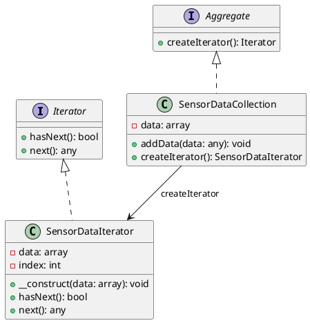

# PHP

Мы работаем в компании, которая занимается анализом данных в реальном времени. Наша задача — создать систему, которая будет собирать данные с различных сенсоров и анализировать их. Мы хотим, чтобы наша система была гибкой и легко расширяемой, чтобы мы могли добавлять новые типы сенсоров и методы анализа данных без необходимости переписывать весь код.

### Описание кейса

Для решения этой задачи мы будем использовать паттерн проектирования "Итератор". Этот паттерн позволяет нам перебирать элементы коллекции без необходимости знать её внутреннюю структуру. В нашем случае, коллекцией будут данные, поступающие с сенсоров, а итератор будет использоваться для их последовательного анализа.

### Пример кода на PHP

**Шаг 1: Определение интерфейса итератора**


```php
<?php
interface Iterator {
    public function hasNext();
    public function next();
}
?>
```


**Шаг 2: Определение интерфейса коллекции**


```php
<?php
interface Aggregate {
    public function createIterator();
}
?>
```


**Шаг 3: Реализация коллекции данных сенсоров**


```php
<?php
class SensorDataCollection implements Aggregate {
    private $data = [];

    public function addData($data) {
        $this->data[] = $data;
    }

    public function createIterator() {
        return new SensorDataIterator($this->data);
    }
}
?>
```


**Шаг 4: Реализация итератора для данных сенсоров**


```php
<?php
class SensorDataIterator implements Iterator {
    private $data;
    private $index = 0;

    public function __construct($data) {
        $this->data = $data;
    }

    public function hasNext() {
        return $this->index < count($this->data);
    }

    public function next() {
        if ($this->hasNext()) {
            return $this->data[$this->index++];
        }
        return null;
    }
}
?>
```


**Шаг 5: Использование итератора для анализа данных**


```php
<?php
function analyzeData(Aggregate $collection) {
    $iterator = $collection->createIterator();
    while ($iterator->hasNext()) {
        $data = $iterator->next();
        // Анализируем данные
        echo "Анализируем данные: " . $data . "\n";
    }
}

// Пример использования
$collection = new SensorDataCollection();
$collection->addData("Данные с сенсора 1");
$collection->addData("Данные с сенсора 2");
$collection->addData("Данные с сенсора 3");

analyzeData($collection);
?>
```


### UML диаграмма

<figure><figcaption><p>UML диаграмма для паттерна "Итератор"</p></figcaption></figure>





### Вывод

Использование паттерна "Итератор" позволяет нам создать гибкую и расширяемую систему для анализа данных в реальном времени. Мы можем легко добавлять новые типы данных и методы анализа, не изменяя существующий код. Это делает нашу систему более устойчивой к изменениям и упрощает её поддержку.
