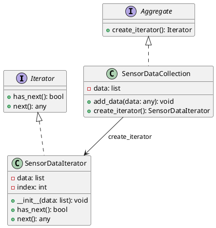

# Python

Мы работаем в компании, которая занимается анализом данных в реальном времени. Наша задача — создать систему, которая будет собирать данные с различных сенсоров и анализировать их. Мы хотим, чтобы наша система была гибкой и легко расширяемой, чтобы мы могли добавлять новые типы сенсоров и методы анализа данных без необходимости переписывать весь код.

### Описание кейса

Для решения этой задачи мы будем использовать паттерн проектирования "Итератор". Этот паттерн позволяет нам перебирать элементы коллекции без необходимости знать её внутреннюю структуру. В нашем случае, коллекцией будут данные, поступающие с сенсоров, а итератор будет использоваться для их последовательного анализа.

### Пример кода на Python

**Шаг 1: Определение интерфейса итератора**


```python
from abc import ABC, abstractmethod

class Iterator(ABC):
    @abstractmethod
    def has_next(self):
        pass

    @abstractmethod
    def next(self):
        pass
```


**Шаг 2: Определение интерфейса коллекции**


```python
class Aggregate(ABC):
    @abstractmethod
    def create_iterator(self):
        pass
```


**Шаг 3: Реализация коллекции данных сенсоров**


```python
class SensorDataCollection(Aggregate):
    def __init__(self):
        self.data = []

    def add_data(self, data):
        self.data.append(data)

    def create_iterator(self):
        return SensorDataIterator(self.data)
```


**Шаг 4: Реализация итератора для данных сенсоров**


```python
class SensorDataIterator(Iterator):
    def __init__(self, data):
        self.data = data
        self.index = 0

    def has_next(self):
        return self.index < len(self.data)

    def next(self):
        if self.has_next():
            data = self.data[self.index]
            self.index += 1
            return data
        return None
```


**Шаг 5: Использование итератора для анализа данных**


```python
def analyze_data(collection):
    iterator = collection.create_iterator()
    while iterator.has_next():
        data = iterator.next()
        # Анализируем данные
        print(f"Анализируем данные: {data}")

# Пример использования
collection = SensorDataCollection()
collection.add_data("Данные с сенсора 1")
collection.add_data("Данные с сенсора 2")
collection.add_data("Данные с сенсора 3")

analyze_data(collection)
```


### UML диаграмма

<figure><figcaption><p>UML диаграмма для паттерна "Итератор"</p></figcaption></figure>





### Вывод

Использование паттерна "Итератор" позволяет нам создать гибкую и расширяемую систему для анализа данных в реальном времени. Мы можем легко добавлять новые типы данных и методы анализа, не изменяя существующий код. Это делает нашу систему более устойчивой к изменениям и упрощает её поддержку.
