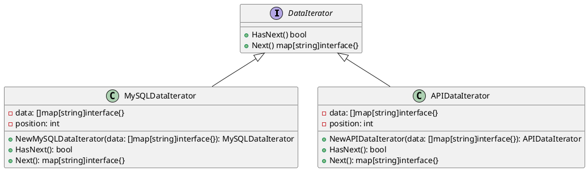

# Go

Представьте, что мы — команда разработчиков, работающих в команде по интеграции данных из различных источников. Наша задача — собрать данные из нескольких баз данных и предоставить их в едином формате для дальнейшего анализа. Для этого мы будем использовать паттерн ООП "Итератор", который позволяет нам последовательно проходить по элементам коллекции без необходимости знать её внутреннюю структуру.

### Описание кейса

Мы хотим создать систему, которая будет собирать данные из двух различных источников: базы данных MySQL и API-сервиса. Мы будем использовать паттерн Итератор для того, чтобы абстрагироваться от конкретных деталей получения данных и предоставить единый интерфейс для их обработки.

### Пример кода на Go

**1. Создание интерфейса Итератора**


```go
package main

import "fmt"

type DataIterator interface {
    HasNext() bool
    Next() map[string]interface{}
}
```


**2. Реализация Итератора для базы данных MySQL**


```go
type MySQLDataIterator struct {
    data     []map[string]interface{}
    position int
}

func NewMySQLDataIterator(data []map[string]interface{}) *MySQLDataIterator {
    return &MySQLDataIterator{data: data, position: 0}
}

func (i *MySQLDataIterator) HasNext() bool {
    return i.position < len(i.data)
}

func (i *MySQLDataIterator) Next() map[string]interface{} {
    if !i.HasNext() {
        return nil
    }
    item := i.data[i.position]
    i.position++
    return item
}
```


**3. Реализация Итератора для API-сервиса**


```go
type APIDataIterator struct {
    data     []map[string]interface{}
    position int
}

func NewAPIDataIterator(data []map[string]interface{}) *APIDataIterator {
    return &APIDataIterator{data: data, position: 0}
}

func (i *APIDataIterator) HasNext() bool {
    return i.position < len(i.data)
}

func (i *APIDataIterator) Next() map[string]interface{} {
    if !i.HasNext() {
        return nil
    }
    item := i.data[i.position]
    i.position++
    return item
}
```


**4. Использование Итераторов**


```go
func processData(iterator DataIterator) {
    for iterator.HasNext() {
        item := iterator.Next()
        fmt.Printf("ID: %v, Name: %v\n", item["id"], item["name"])
    }
}

func main() {
    // Пример данных из MySQL
    mysqlData := []map[string]interface{}{
        {"id": 1, "name": "Alice"},
        {"id": 2, "name": "Bob"},
    }

    // Пример данных из API
    apiData := []map[string]interface{}{
        {"id": 3, "name": "Charlie"},
        {"id": 4, "name": "David"},
    }

    // Создание итераторов
    mysqlIterator := NewMySQLDataIterator(mysqlData)
    apiIterator := NewAPIDataIterator(apiData)

    // Обработка данных из MySQL
    processData(mysqlIterator)

    // Обработка данных из API
    processData(apiIterator)
}
```


#### UML диаграмма

<figure><figcaption><p>UML диаграмма для паттерна "Итератор"</p></figcaption></figure>





#### Вывод

В этом кейсе мы использовали паттерн Итератор для создания единого интерфейса для обработки данных из различных источников. Это позволило нам абстрагироваться от конкретных деталей получения данных и предоставить единый способ их обработки. Такой подход упрощает код, делает его более гибким и легким для расширения в будущем.
