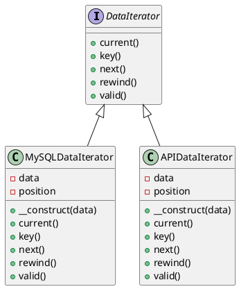

# PHP

Представьте, что мы — команда разработчиков, работающих в команде по интеграции данных из различных источников. Наша задача — собрать данные из нескольких баз данных и предоставить их в едином формате для дальнейшего анализа. Для этого мы будем использовать паттерн ООП "Итератор", который позволяет нам последовательно проходить по элементам коллекции без необходимости знать её внутреннюю структуру.

### Описание кейса

Мы хотим создать систему, которая будет собирать данные из двух различных источников: базы данных MySQL и API-сервиса. Мы будем использовать паттерн Итератор для того, чтобы абстрагироваться от конкретных деталей получения данных и предоставить единый интерфейс для их обработки.

### Пример кода на PHP

**1. Создание интерфейса Итератора**


```php
interface DataIterator {
    public function current();
    public function key();
    public function next();
    public function rewind();
    public function valid();
}
```


**2. Реализация Итератора для базы данных MySQL**


```php
class MySQLDataIterator implements DataIterator {
    private $data;
    private $position = 0;

    public function __construct($data) {
        $this->data = $data;
    }

    public function current() {
        return $this->data[$this->position];
    }

    public function key() {
        return $this->position;
    }

    public function next() {
        ++$this->position;
    }

    public function rewind() {
        $this->position = 0;
    }

    public function valid() {
        return isset($this->data[$this->position]);
    }
}
```


**3. Реализация Итератора для API-сервиса**


```php
class APIDataIterator implements DataIterator {
    private $data;
    private $position = 0;

    public function __construct($data) {
        $this->data = $data;
    }

    public function current() {
        return $this->data[$this->position];
    }

    public function key() {
        return $this->position;
    }

    public function next() {
        ++$this->position;
    }

    public function rewind() {
        $this->position = 0;
    }

    public function valid() {
        return isset($this->data[$this->position]);
    }
}
```


**4. Использование Итераторов**


```php
// Пример данных из MySQL
$mysqlData = [
    ['id' => 1, 'name' => 'Alice'],
    ['id' => 2, 'name' => 'Bob'],
];

// Пример данных из API
$apiData = [
    ['id' => 3, 'name' => 'Charlie'],
    ['id' => 4, 'name' => 'David'],
];

// Создание итераторов
$mysqlIterator = new MySQLDataIterator($mysqlData);
$apiIterator = new APIDataIterator($apiData);

// Функция для обработки данных
function processData(DataIterator $iterator) {
    foreach ($iterator as $item) {
        echo 'ID: ' . $item['id'] . ', Name: ' . $item['name'] . "\n";
    }
}

// Обработка данных из MySQL
processData($mysqlIterator);

// Обработка данных из API
processData($apiIterator);
```


### UML диаграмма

<figure><figcaption><p>UML диаграмма для паттерна "Итератор"</p></figcaption></figure>





### Вывод

В этом кейсе мы использовали паттерн Итератор для создания единого интерфейса для обработки данных из различных источников. Это позволило нам абстрагироваться от конкретных деталей получения данных и предоставить единый способ их обработки. Такой подход упрощает код, делает его более гибким и легким для расширения в будущем.
