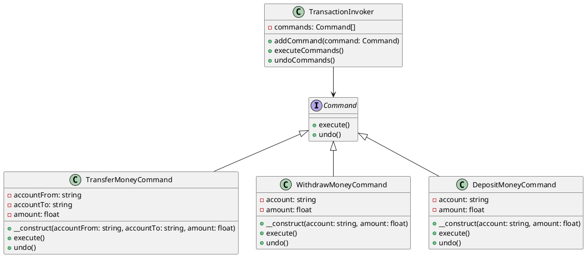

# PHP

Представьте, что мы работаем в компании, которая разрабатывает программное обеспечение для управления финансовыми операциями. Наша задача — создать систему, которая позволяет выполнять различные транзакции в базе данных, такие как перевод денег между счетами, снятие наличных и пополнение счета. Мы хотим, чтобы наша система была гибкой и легко расширяемой, чтобы в будущем можно было добавлять новые типы транзакций без изменения существующего кода.

### Описание

Паттерн Команда (Command) позволяет инкапсулировать запрос на выполнение операции в виде объекта. Это позволяет параметризовать объекты с операциями, задавать очередь операций, хранить историю выполнения операций и поддерживать отмену операций.

### Пример кода на PHP

**1. Интерфейс команды**


```php
<?php

interface Command {
    public function execute();
    public function undo();
}
```


**2. Конкретные команды**


```php
<?php

class TransferMoneyCommand implements Command {
    private $accountFrom;
    private $accountTo;
    private $amount;

    public function __construct($accountFrom, $accountTo, $amount) {
        $this->accountFrom = $accountFrom;
        $this->accountTo = $accountTo;
        $this->amount = $amount;
    }

    public function execute() {
        // Логика перевода денег
        echo "Перевод $this->amount с $this->accountFrom на $this->accountTo\n";
    }

    public function undo() {
        // Логика отмены перевода
        echo "Отмена перевода $this->amount с $this->accountFrom на $this->accountTo\n";
    }
}

class WithdrawMoneyCommand implements Command {
    private $account;
    private $amount;

    public function __construct($account, $amount) {
        $this->account = $account;
        $this->amount = $amount;
    }

    public function execute() {
        // Логика снятия денег
        echo "Снятие $this->amount с $this->account\n";
    }

    public function undo() {
        // Логика отмены снятия
        echo "Отмена снятия $this->amount с $this->account\n";
    }
}

class DepositMoneyCommand implements Command {
    private $account;
    private $amount;

    public function __construct($account, $amount) {
        $this->account = $account;
        $this->amount = $amount;
    }

    public function execute() {
        // Логика пополнения счета
        echo "Пополнение $this->amount на $this->account\n";
    }

    public function undo() {
        // Логика отмены пополнения
        echo "Отмена пополнения $this->amount на $this->account\n";
    }
}
```


**3. Вызывающий объект (Invoker)**


```php
<?php

class TransactionInvoker {
    private $commands = [];

    public function addCommand(Command $command) {
        $this->commands[] = $command;
    }

    public function executeCommands() {
        foreach ($this->commands as $command) {
            $command->execute();
        }
    }

    public function undoCommands() {
        foreach (array_reverse($this->commands) as $command) {
            $command->undo();
        }
    }
}
```


**4. Пример использования**


```php
<?php

$invoker = new TransactionInvoker();

$transferCommand = new TransferMoneyCommand('Account1', 'Account2', 100);
$withdrawCommand = new WithdrawMoneyCommand('Account1', 50);
$depositCommand = new DepositMoneyCommand('Account2', 150);

$invoker->addCommand($transferCommand);
$invoker->addCommand($withdrawCommand);
$invoker->addCommand($depositCommand);

$invoker->executeCommands();
$invoker->undoCommands();
```


### UML диаграмма

<figure><figcaption><p>UML диаграмма для паттерна "Команда"</p></figcaption></figure>





### Вывод для кейса

Использование паттерна Команда позволяет нам гибко управлять различными транзакциями в базе данных. Мы можем легко добавлять новые типы транзакций, не изменяя существующий код. Это делает нашу систему более модульной и удобной для расширения. Кроме того, паттерн Команда позволяет нам легко реализовать функции отмены операций, что является важным аспектом для финансовых систем.
