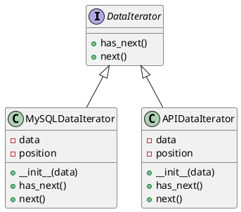

# Python

Представьте, что мы — команда разработчиков, работающих в команде по интеграции данных из различных источников. Наша задача — собрать данные из нескольких баз данных и предоставить их в едином формате для дальнейшего анализа. Для этого мы будем использовать паттерн ООП "Итератор", который позволяет нам последовательно проходить по элементам коллекции без необходимости знать её внутреннюю структуру.

### Описание кейса

Мы хотим создать систему, которая будет собирать данные из двух различных источников: базы данных MySQL и API-сервиса. Мы будем использовать паттерн Итератор для того, чтобы абстрагироваться от конкретных деталей получения данных и предоставить единый интерфейс для их обработки.

### Пример кода на Python

**1. Создание интерфейса Итератора**


```python
from abc import ABC, abstractmethod

class DataIterator(ABC):
    @abstractmethod
    def has_next(self):
        pass

    @abstractmethod
    def next(self):
        pass
```


**2. Реализация Итератора для базы данных MySQL**


```python
class MySQLDataIterator(DataIterator):
    def __init__(self, data):
        self.data = data
        self.position = 0

    def has_next(self):
        return self.position < len(self.data)

    def next(self):
        if not self.has_next():
            return None
        item = self.data[self.position]
        self.position += 1
        return item
```


**3. Реализация Итератора для API-сервиса**


```python
class APIDataIterator(DataIterator):
    def __init__(self, data):
        self.data = data
        self.position = 0

    def has_next(self):
        return self.position < len(self.data)

    def next(self):
        if not self.has_next():
            return None
        item = self.data[self.position]
        self.position += 1
        return item
```


**4. Использование Итераторов**


```python
def process_data(iterator):
    while iterator.has_next():
        item = iterator.next()
        print(f"ID: {item['id']}, Name: {item['name']}")

if __name__ == "__main__":
    # Пример данных из MySQL
    mysql_data = [
        {"id": 1, "name": "Alice"},
        {"id": 2, "name": "Bob"},
    ]

    # Пример данных из API
    api_data = [
        {"id": 3, "name": "Charlie"},
        {"id": 4, "name": "David"},
    ]

    # Создание итераторов
    mysql_iterator = MySQLDataIterator(mysql_data)
    api_iterator = APIDataIterator(api_data)

    # Обработка данных из MySQL
    process_data(mysql_iterator)

    # Обработка данных из API
    process_data(api_iterator)
```


### UML диаграмма

<figure><figcaption><p>UML диаграмма для паттерна "Итератор"</p></figcaption></figure>





### Вывод

В этом кейсе мы использовали паттерн Итератор для создания единого интерфейса для обработки данных из различных источников. Это позволило нам абстрагироваться от конкретных деталей получения данных и предоставить единый способ их обработки. Такой подход упрощает код, делает его более гибким и легким для расширения в будущем.
