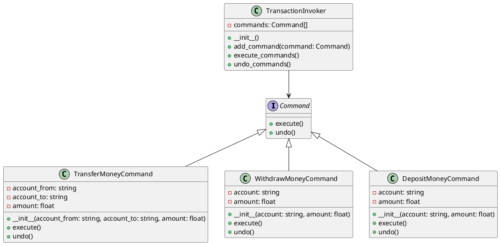

# Python

Представьте, что мы работаем в компании, которая разрабатывает программное обеспечение для управления финансовыми операциями. Наша задача — создать систему, которая позволяет выполнять различные транзакции в базе данных, такие как перевод денег между счетами, снятие наличных и пополнение счета. Мы хотим, чтобы наша система была гибкой и легко расширяемой, чтобы в будущем можно было добавлять новые типы транзакций без изменения существующего кода.

### Описание

Паттерн Команда (Command) позволяет инкапсулировать запрос на выполнение операции в виде объекта. Это позволяет параметризовать объекты с операциями, задавать очередь операций, хранить историю выполнения операций и поддерживать отмену операций.

### Пример кода на Python

**1. Интерфейс команды**


```python
from abc import ABC, abstractmethod

class Command(ABC):
    @abstractmethod
    def execute(self):
        pass

    @abstractmethod
    def undo(self):
        pass
```


**2. Конкретные команды**


```python
class TransferMoneyCommand(Command):
    def __init__(self, account_from, account_to, amount):
        self.account_from = account_from
        self.account_to = account_to
        self.amount = amount

    def execute(self):
        # Логика перевода денег
        print(f"Перевод {self.amount} с {self.account_from} на {self.account_to}")

    def undo(self):
        # Логика отмены перевода
        print(f"Отмена перевода {self.amount} с {self.account_from} на {self.account_to}")

class WithdrawMoneyCommand(Command):
    def __init__(self, account, amount):
        self.account = account
        self.amount = amount

    def execute(self):
        # Логика снятия денег
        print(f"Снятие {self.amount} с {self.account}")

    def undo(self):
        # Логика отмены снятия
        print(f"Отмена снятия {self.amount} с {self.account}")

class DepositMoneyCommand(Command):
    def __init__(self, account, amount):
        self.account = account
        self.amount = amount

    def execute(self):
        # Логика пополнения счета
        print(f"Пополнение {self.amount} на {self.account}")

    def undo(self):
        # Логика отмены пополнения
        print(f"Отмена пополнения {self.amount} на {self.account}")
```


**3. Вызывающий объект (Invoker)**


```python
class TransactionInvoker:
    def __init__(self):
        self.commands = []

    def add_command(self, command):
        self.commands.append(command)

    def execute_commands(self):
        for command in self.commands:
            command.execute()

    def undo_commands(self):
        for command in reversed(self.commands):
            command.undo()
```


**4. Пример использования**


```python
if __name__ == "__main__":
    invoker = TransactionInvoker()

    transfer_command = TransferMoneyCommand('Account1', 'Account2', 100)
    withdraw_command = WithdrawMoneyCommand('Account1', 50)
    deposit_command = DepositMoneyCommand('Account2', 150)

    invoker.add_command(transfer_command)
    invoker.add_command(withdraw_command)
    invoker.add_command(deposit_command)

    invoker.execute_commands()
    invoker.undo_commands()
```


### UML диаграмма

<figure><figcaption><p>UML диаграмма для паттерна "Команда"</p></figcaption></figure>





### Вывод для кейса

Использование паттерна Команда позволяет нам гибко управлять различными транзакциями в базе данных. Мы можем легко добавлять новые типы транзакций, не изменяя существующий код. Это делает нашу систему более модульной и удобной для расширения. Кроме того, паттерн Команда позволяет нам легко реализовать функции отмены операций, что является важным аспектом для финансовых систем.
