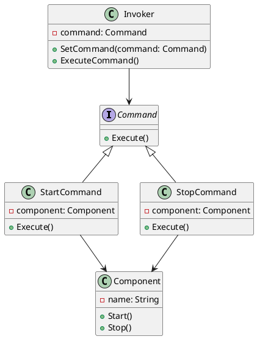

# Go

Представьте, что мы разрабатываем приложение для управления состоянием различных компонентов системы. Наше приложение должно уметь включать и выключать различные компоненты, такие как серверы, базы данных и другие сервисы. Мы хотим, чтобы наше приложение было гибким и легко расширяемым, чтобы в будущем можно было добавлять новые команды без изменения существующего кода.

Для этого мы будем использовать паттерн проектирования "Команда" (Command). Этот паттерн позволяет инкапсулировать запрос как объект, что позволяет параметризовать клиентов с различными запросами, очередями или логированием запросов, а также поддерживать отмену операций.

### Описание кейса

Мы создадим систему управления состоянием приложения, которая будет включать и выключать компоненты. Мы будем использовать паттерн "Команда" для инкапсуляции команд включения и выключения.

### Пример кода на Go

**1. Создание интерфейса команды**


```go
package main

type Command interface {
    Execute()
}
```


**2. Создание конкретных команд**


```go
package main

type StartCommand struct {
    component *Component
}

func (c *StartCommand) Execute() {
    c.component.Start()
}

type StopCommand struct {
    component *Component
}

func (c *StopCommand) Execute() {
    c.component.Stop()
}
```


**3. Создание получателя команд**


```go
package main

import "fmt"

type Component struct {
    name string
}

func (c *Component) Start() {
    fmt.Printf("Компонент %s запущен.\n", c.name)
}

func (c *Component) Stop() {
    fmt.Printf("Компонент %s остановлен.\n", c.name)
}
```


**4. Создание отправителя команд**


```go
package main

type Invoker struct {
    command Command
}

func (i *Invoker) SetCommand(command Command) {
    i.command = command
}

func (i *Invoker) ExecuteCommand() {
    i.command.Execute()
}
```


**5. Пример использования**


```go
package main

func main() {
    // Создаем компонент
    component := &Component{name: "Сервер"}

    // Создаем команды
    startCommand := &StartCommand{component: component}
    stopCommand := &StopCommand{component: component}

    // Создаем отправителя команд
    invoker := &Invoker{}

    // Устанавливаем и выполняем команду запуска
    invoker.SetCommand(startCommand)
    invoker.ExecuteCommand()

    // Устанавливаем и выполняем команду остановки
    invoker.SetCommand(stopCommand)
    invoker.ExecuteCommand()
}
```


### UML диаграмма

<figure><figcaption><p>UML диаграмма для паттерна "Команда"</p></figcaption></figure>





### Вывод для кейса

Использование паттерна "Команда" позволяет нам гибко управлять состоянием компонентов нашего приложения. Мы можем легко добавлять новые команды, не изменяя существующий код. Это делает наше приложение более гибким и расширяемым. В данном кейсе мы создали команды для запуска и остановки компонентов, а также отправителя команд, который может выполнять эти команды. Это позволяет нам легко управлять состоянием наших компонентов и добавлять новые команды в будущем.
