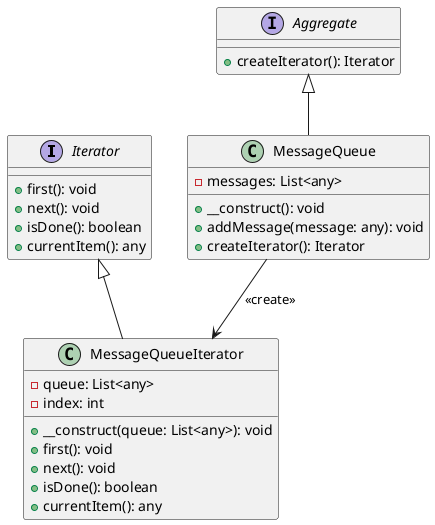

# PHP

Мы — команда разработчиков, работающая над веб-приложением для управления очередями сообщений. Наша задача — обработать все сообщения в очереди и выполнить определенные действия для каждого сообщения. Для этого мы будем использовать паттерн "Итератор", который позволит нам последовательно обрабатывать элементы очереди, не заботясь о её внутренней структуре.

### Описание кейса

Мы хотим создать систему, которая будет обрабатывать сообщения из очереди. Каждое сообщение может содержать различные данные, и нам нужно выполнить определенные действия для каждого сообщения. Паттерн "Итератор" поможет нам абстрагироваться от внутренней структуры очереди и сосредоточиться на обработке сообщений.

### Пример кода на PHP

**1. Определение интерфейса Iterator**


```php
interface Iterator {
    public function first();
    public function next();
    public function isDone();
    public function currentItem();
}
```


**2. Определение интерфейса Aggregate**


```php
interface Aggregate {
    public function createIterator();
}
```


**3. Реализация конкретного итератора**


```php
class MessageQueueIterator implements Iterator {
    private $queue;
    private $index;

    public function __construct($queue) {
        $this->queue = $queue;
        $this->index = 0;
    }

    public function first() {
        $this->index = 0;
    }

    public function next() {
        $this->index++;
    }

    public function isDone() {
        return $this->index >= count($this->queue);
    }

    public function currentItem() {
        if ($this->isDone()) {
            return null;
        }
        return $this->queue[$this->index];
    }
}
```


**4. Реализация конкретного агрегата**


```php
class MessageQueue implements Aggregate {
    private $messages;

    public function __construct() {
        $this->messages = [];
    }

    public function addMessage($message) {
        $this->messages[] = $message;
    }

    public function createIterator() {
        return new MessageQueueIterator($this->messages);
    }
}
```


**5. Использование итератора для обработки сообщений**


```php
// Создаем очередь сообщений
$messageQueue = new MessageQueue();
$messageQueue->addMessage("Сообщение 1");
$messageQueue->addMessage("Сообщение 2");
$messageQueue->addMessage("Сообщение 3");

// Создаем итератор для очереди
$iterator = $messageQueue->createIterator();

// Обрабатываем сообщения
for ($iterator->first(); !$iterator->isDone(); $iterator->next()) {
    $message = $iterator->currentItem();
    echo "Обработка сообщения: " . $message . "\n";
}
```


### UML диаграмма

<figure><figcaption><p>UML диаграмма для паттерна "Итератор"</p></figcaption></figure>





### Вывод

В этом кейсе мы рассмотрели применение паттерна "Итератор" для обработки сообщений в очереди. Мы создали интерфейсы `Iterator` и `Aggregate`, а также их конкретные реализации `MessageQueueIterator` и `MessageQueue`. Это позволило нам абстрагироваться от внутренней структуры очереди и сосредоточиться на обработке сообщений.

Паттерн "Итератор" оказался очень полезным для последовательной обработки элементов коллекции, не заботясь о её внутренней структуре. Это упрощает код и делает его более гибким и поддерживаемым.

Надеюсь, этот пример поможет вам лучше понять, как использовать паттерн "Итератор" в ваших проектах!
