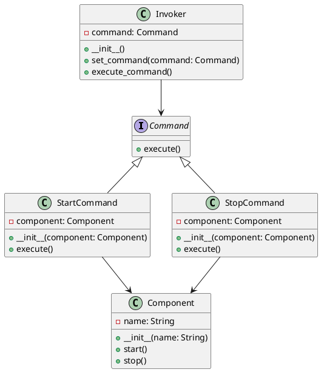

# Python

Представьте, что мы разрабатываем приложение для управления состоянием различных компонентов системы. Наше приложение должно уметь включать и выключать различные компоненты, такие как серверы, базы данных и другие сервисы. Мы хотим, чтобы наше приложение было гибким и легко расширяемым, чтобы в будущем можно было добавлять новые команды без изменения существующего кода.

Для этого мы будем использовать паттерн проектирования "Команда" (Command). Этот паттерн позволяет инкапсулировать запрос как объект, что позволяет параметризовать клиентов с различными запросами, очередями или логированием запросов, а также поддерживать отмену операций.

### Описание кейса

Мы создадим систему управления состоянием приложения, которая будет включать и выключать компоненты. Мы будем использовать паттерн "Команда" для инкапсуляции команд включения и выключения.

### Пример кода на Python

**1. Создание интерфейса команды**


```python
from abc import ABC, abstractmethod

class Command(ABC):
    @abstractmethod
    def execute(self):
        pass
```


**2. Создание конкретных команд**


```python
class StartCommand(Command):
    def __init__(self, component):
        self.component = component

    def execute(self):
        self.component.start()

class StopCommand(Command):
    def __init__(self, component):
        self.component = component

    def execute(self):
        self.component.stop()
```


**3. Создание получателя команд**


```python
class Component:
    def __init__(self, name):
        self.name = name

    def start(self):
        print(f"Компонент {self.name} запущен.")

    def stop(self):
        print(f"Компонент {self.name} остановлен.")
```


**4. Создание отправителя команд**


```python
class Invoker:
    def __init__(self):
        self.command = None

    def set_command(self, command):
        self.command = command

    def execute_command(self):
        self.command.execute()
```


**5. Пример использования**


```python
if __name__ == "__main__":
    # Создаем компонент
    component = Component("Сервер")

    # Создаем команды
    start_command = StartCommand(component)
    stop_command = StopCommand(component)

    # Создаем отправителя команд
    invoker = Invoker()

    # Устанавливаем и выполняем команду запуска
    invoker.set_command(start_command)
    invoker.execute_command()

    # Устанавливаем и выполняем команду остановки
    invoker.set_command(stop_command)
    invoker.execute_command()
```


### UML диаграмма

<figure><figcaption><p>UML диаграмма для паттерна "Команда"</p></figcaption></figure>





### Вывод для кейса

Использование паттерна "Команда" позволяет нам гибко управлять состоянием компонентов нашего приложения. Мы можем легко добавлять новые команды, не изменяя существующий код. Это делает наше приложение более гибким и расширяемым. В данном кейсе мы создали команды для запуска и остановки компонентов, а также отправителя команд, который может выполнять эти команды. Это позволяет нам легко управлять состоянием наших компонентов и добавлять новые команды в будущем.
