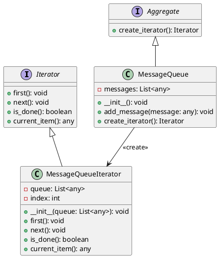

# Python

Мы — команда разработчиков, работающая над веб-приложением для управления очередями сообщений. Наша задача — обработать все сообщения в очереди и выполнить определенные действия для каждого сообщения. Для этого мы будем использовать паттерн "Итератор", который позволит нам последовательно обрабатывать элементы очереди, не заботясь о её внутренней структуре.

### Описание кейса

Мы хотим создать систему, которая будет обрабатывать сообщения из очереди. Каждое сообщение может содержать различные данные, и нам нужно выполнить определенные действия для каждого сообщения. Паттерн "Итератор" поможет нам абстрагироваться от внутренней структуры очереди и сосредоточиться на обработке сообщений.

### Пример кода на Python

**1. Определение интерфейса Iterator**


```python
from abc import ABC, abstractmethod

class Iterator(ABC):
    @abstractmethod
    def first(self):
        pass

    @abstractmethod
    def next(self):
        pass

    @abstractmethod
    def is_done(self):
        pass

    @abstractmethod
    def current_item(self):
        pass
```


**2. Определение интерфейса Aggregate**


```python
class Aggregate(ABC):
    @abstractmethod
    def create_iterator(self):
        pass
```


**3. Реализация конкретного итератора**


```python
class MessageQueueIterator(Iterator):
    def __init__(self, queue):
        self.queue = queue
        self.index = 0

    def first(self):
        self.index = 0

    def next(self):
        self.index += 1

    def is_done(self):
        return self.index >= len(self.queue)

    def current_item(self):
        if self.is_done():
            return None
        return self.queue[self.index]
```


**4. Реализация конкретного агрегата**


```python
class MessageQueue(Aggregate):
    def __init__(self):
        self.messages = []

    def add_message(self, message):
        self.messages.append(message)

    def create_iterator(self):
        return MessageQueueIterator(self.messages)
```


**5. Использование итератора для обработки сообщений**

```python
def main():
    # Создаем очередь сообщений
    message_queue = MessageQueue()
    message_queue.add_message("Сообщение 1")
    message_queue.add_message("Сообщение 2")
    message_queue.add_message("Сообщение 3")

    # Создаем итератор для очереди
    iterator = message_queue.create_iterator()

    # Обрабатываем сообщения
    for iterator.first(); not iterator.is_done(); iterator.next():
        message = iterator.current_item()
        print(f"Обработка сообщения: {message}")

if __name__ == "__main__":
    main()
```

### UML диаграмма

<figure><figcaption><p>UML диаграмма для паттерна "Итератор"</p></figcaption></figure>





#### Вывод

В этом кейсе мы рассмотрели применение паттерна "Итератор" для обработки сообщений в очереди. Мы создали интерфейсы `Iterator` и `Aggregate`, а также их конкретные реализации `MessageQueueIterator` и `MessageQueue`. Это позволило нам абстрагироваться от внутренней структуры очереди и сосредоточиться на обработке сообщений.

Паттерн "Итератор" оказался очень полезным для последовательной обработки элементов коллекции, не заботясь о её внутренней структуре. Это упрощает код и делает его более гибким и поддерживаемым.
