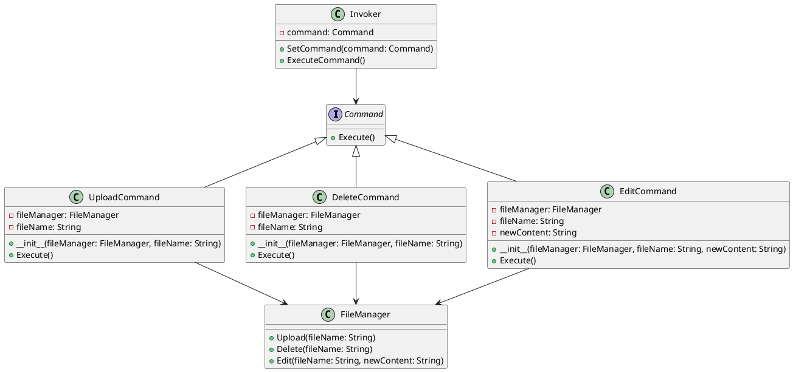

# Go

Представьте, что мы разрабатываем приложение для управления файлами и загрузками. Наше приложение должно уметь выполнять различные операции с файлами, такие как загрузка, удаление и редактирование. Мы хотим, чтобы наше приложение было гибким и легко расширяемым, чтобы в будущем можно было добавлять новые команды без изменения существующего кода.

Для этого мы будем использовать паттерн проектирования "Команда" (Command). Этот паттерн позволяет инкапсулировать запрос как объект, что позволяет параметризовать клиентов с различными запросами, очередями или логированием запросов, а также поддерживать отмену операций.

### Описание кейса

Мы создадим систему управления файлами, которая будет выполнять различные операции с файлами. Мы будем использовать паттерн "Команда" для инкапсуляции команд загрузки, удаления и редактирования файлов.

### Пример кода на Go

**1. Создание интерфейса команды**

```go
package main

type Command interface {
    Execute()
}
```

**2. Создание конкретных команд**


```go
package main

type UploadCommand struct {
    fileManager *FileManager
    fileName   string
}

func (c *UploadCommand) Execute() {
    c.fileManager.Upload(c.fileName)
}

type DeleteCommand struct {
    fileManager *FileManager
    fileName    string
}

func (c *DeleteCommand) Execute() {
    c.fileManager.Delete(c.fileName)
}

type EditCommand struct {
    fileManager *FileManager
    fileName    string
    newContent  string
}

func (c *EditCommand) Execute() {
    c.fileManager.Edit(c.fileName, c.newContent)
}
```


**3. Создание получателя команд**


```go
package main

import "fmt"

type FileManager struct{}

func (f *FileManager) Upload(fileName string) {
    fmt.Printf("Файл %s загружен.\n", fileName)
}

func (f *FileManager) Delete(fileName string) {
    fmt.Printf("Файл %s удален.\n", fileName)
}

func (f *FileManager) Edit(fileName, newContent string) {
    fmt.Printf("Файл %s отредактирован. Новое содержимое: %s\n", fileName, newContent)
}
```


**4. Создание отправителя команд**


```go
package main

type Invoker struct {
    command Command
}

func (i *Invoker) SetCommand(command Command) {
    i.command = command
}

func (i *Invoker) ExecuteCommand() {
    i.command.Execute()
}
```


**5. Пример использования**


```go
package main

func main() {
    // Создаем менеджер файлов
    fileManager := &FileManager{}

    // Создаем команды
    uploadCommand := &UploadCommand{fileManager: fileManager, fileName: "file1.txt"}
    deleteCommand := &DeleteCommand{fileManager: fileManager, fileName: "file2.txt"}
    editCommand := &EditCommand{fileManager: fileManager, fileName: "file3.txt", newContent: "Новое содержимое"}

    // Создаем отправителя команд
    invoker := &Invoker{}

    // Устанавливаем и выполняем команду загрузки
    invoker.SetCommand(uploadCommand)
    invoker.ExecuteCommand()

    // Устанавливаем и выполняем команду удаления
    invoker.SetCommand(deleteCommand)
    invoker.ExecuteCommand()

    // Устанавливаем и выполняем команду редактирования
    invoker.SetCommand(editCommand)
    invoker.ExecuteCommand()
}
```


### UML диаграмма

<figure><figcaption><p>UML диаграмма для паттерна "Команда"</p></figcaption></figure>





### Вывод для кейса

Использование паттерна "Команда" позволяет нам гибко управлять операциями с файлами в нашем приложении. Мы можем легко добавлять новые команды, не изменяя существующий код. Это делает наше приложение более гибким и расширяемым. В данном кейсе мы создали команды для загрузки, удаления и редактирования файлов, а также отправителя команд, который может выполнять эти команды. Это позволяет нам легко управлять операциями с файлами и добавлять новые команды в будущем.
