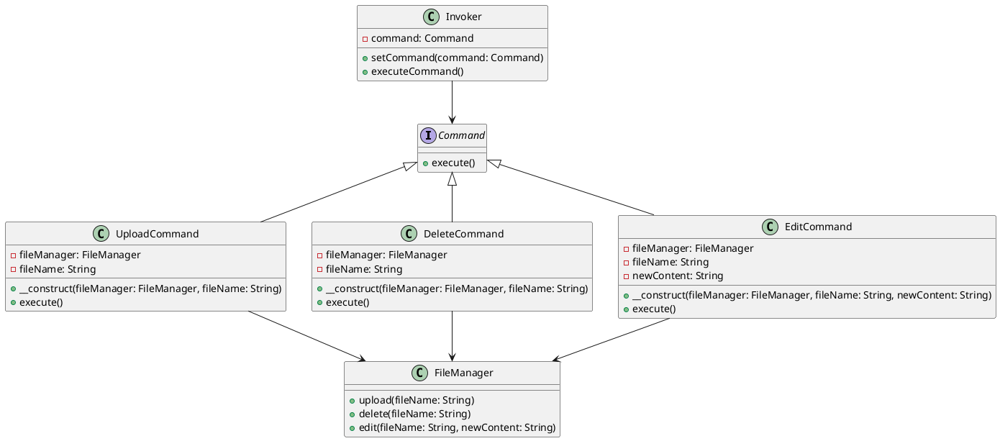

# PHP

Представьте, что мы разрабатываем приложение для управления файлами и загрузками. Наше приложение должно уметь выполнять различные операции с файлами, такие как загрузка, удаление и редактирование. Мы хотим, чтобы наше приложение было гибким и легко расширяемым, чтобы в будущем можно было добавлять новые команды без изменения существующего кода.

Для этого мы будем использовать паттерн проектирования "Команда" (Command). Этот паттерн позволяет инкапсулировать запрос как объект, что позволяет параметризовать клиентов с различными запросами, очередями или логированием запросов, а также поддерживать отмену операций.

### Описание кейса

Мы создадим систему управления файлами, которая будет выполнять различные операции с файлами. Мы будем использовать паттерн "Команда" для инкапсуляции команд загрузки, удаления и редактирования файлов.

### Пример кода на PHP

**1. Создание интерфейса команды**


```php
<?php
interface Command {
    public function execute();
}
```


**2. Создание конкретных команд**


```php
<?php
class UploadCommand implements Command {
    private $fileManager;
    private $fileName;

    public function __construct($fileManager, $fileName) {
        $this->fileManager = $fileManager;
        $this->fileName = $fileName;
    }

    public function execute() {
        $this->fileManager->upload($this->fileName);
    }
}

class DeleteCommand implements Command {
    private $fileManager;
    private $fileName;

    public function __construct($fileManager, $fileName) {
        $this->fileManager = $fileManager;
        $this->fileName = $fileName;
    }

    public function execute() {
        $this->fileManager->delete($this->fileName);
    }
}

class EditCommand implements Command {
    private $fileManager;
    private $fileName;
    private $newContent;

    public function __construct($fileManager, $fileName, $newContent) {
        $this->fileManager = $fileManager;
        $this->fileName = $fileName;
        $this->newContent = $newContent;
    }

    public function execute() {
        $this->fileManager->edit($this->fileName, $this->newContent);
    }
}
```


**3. Создание получателя команд**


```php
<?php
class FileManager {
    public function upload($fileName) {
        echo "Файл {$fileName} загружен.\n";
    }

    public function delete($fileName) {
        echo "Файл {$fileName} удален.\n";
    }

    public function edit($fileName, $newContent) {
        echo "Файл {$fileName} отредактирован. Новое содержимое: {$newContent}\n";
    }
}
```


**4. Создание отправителя команд**


```php
<?php
class Invoker {
    private $command;

    public function setCommand(Command $command) {
        $this->command = $command;
    }

    public function executeCommand() {
        $this->command->execute();
    }
}
```


**5. Пример использования**


```php
<?php
// Создаем менеджер файлов
$fileManager = new FileManager();

// Создаем команды
$uploadCommand = new UploadCommand($fileManager, 'file1.txt');
$deleteCommand = new DeleteCommand($fileManager, 'file2.txt');
$editCommand = new EditCommand($fileManager, 'file3.txt', 'Новое содержимое');

// Создаем отправителя команд
$invoker = new Invoker();

// Устанавливаем и выполняем команду загрузки
$invoker->setCommand($uploadCommand);
$invoker->executeCommand();

// Устанавливаем и выполняем команду удаления
$invoker->setCommand($deleteCommand);
$invoker->executeCommand();

// Устанавливаем и выполняем команду редактирования
$invoker->setCommand($editCommand);
$invoker->executeCommand();
```


### UML диаграмма

<figure><figcaption><p>UML диаграмма для паттерна "Команда"</p></figcaption></figure>





### Вывод для кейса

Использование паттерна "Команда" позволяет нам гибко управлять операциями с файлами в нашем приложении. Мы можем легко добавлять новые команды, не изменяя существующий код. Это делает наше приложение более гибким и расширяемым. В данном кейсе мы создали команды для загрузки, удаления и редактирования файлов, а также отправителя команд, который может выполнять эти команды. Это позволяет нам легко управлять операциями с файлами и добавлять новые команды в будущем.
