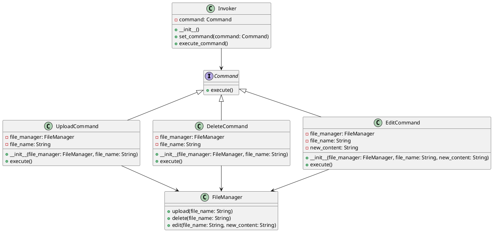

# Python

Представьте, что мы разрабатываем приложение для управления файлами и загрузками. Наше приложение должно уметь выполнять различные операции с файлами, такие как загрузка, удаление и редактирование. Мы хотим, чтобы наше приложение было гибким и легко расширяемым, чтобы в будущем можно было добавлять новые команды без изменения существующего кода.

Для этого мы будем использовать паттерн проектирования "Команда" (Command). Этот паттерн позволяет инкапсулировать запрос как объект, что позволяет параметризовать клиентов с различными запросами, очередями или логированием запросов, а также поддерживать отмену операций.

### Описание кейса

Мы создадим систему управления файлами, которая будет выполнять различные операции с файлами. Мы будем использовать паттерн "Команда" для инкапсуляции команд загрузки, удаления и редактирования файлов.

### Пример кода на Python

**1. Создание интерфейса команды**


```python
from abc import ABC, abstractmethod

class Command(ABC):
    @abstractmethod
    def execute(self):
        pass
```


**2. Создание конкретных команд**


```python
class UploadCommand(Command):
    def __init__(self, file_manager, file_name):
        self.file_manager = file_manager
        self.file_name = file_name

    def execute(self):
        self.file_manager.upload(self.file_name)

class DeleteCommand(Command):
    def __init__(self, file_manager, file_name):
        self.file_manager = file_manager
        self.file_name = file_name

    def execute(self):
        self.file_manager.delete(self.file_name)

class EditCommand(Command):
    def __init__(self, file_manager, file_name, new_content):
        self.file_manager = file_manager
        self.file_name = file_name
        self.new_content = new_content

    def execute(self):
        self.file_manager.edit(self.file_name, self.new_content)
```


**3. Создание получателя команд**


```python
class FileManager:
    def upload(self, file_name):
        print(f"Файл {file_name} загружен.")

    def delete(self, file_name):
        print(f"Файл {file_name} удален.")

    def edit(self, file_name, new_content):
        print(f"Файл {file_name} отредактирован. Новое содержимое: {new_content}")
```


**4. Создание отправителя команд**


```python
class Invoker:
    def __init__(self):
        self.command = None

    def set_command(self, command):
        self.command = command

    def execute_command(self):
        self.command.execute()
```


**5. Пример использования**


```python
if __name__ == "__main__":
    # Создаем менеджер файлов
    file_manager = FileManager()

    # Создаем команды
    upload_command = UploadCommand(file_manager, 'file1.txt')
    delete_command = DeleteCommand(file_manager, 'file2.txt')
    edit_command = EditCommand(file_manager, 'file3.txt', 'Новое содержимое')

    # Создаем отправителя команд
    invoker = Invoker()

    # Устанавливаем и выполняем команду загрузки
    invoker.set_command(upload_command)
    invoker.execute_command()

    # Устанавливаем и выполняем команду удаления
    invoker.set_command(delete_command)
    invoker.execute_command()

    # Устанавливаем и выполняем команду редактирования
    invoker.set_command(edit_command)
    invoker.execute_command()
```


### UML диаграмма

<figure><figcaption><p>UML диаграмма для паттерна "Команда"</p></figcaption></figure>





### Вывод для кейса

Использование паттерна "Команда" позволяет нам гибко управлять операциями с файлами в нашем приложении. Мы можем легко добавлять новые команды, не изменяя существующий код. Это делает наше приложение более гибким и расширяемым. В данном кейсе мы создали команды для загрузки, удаления и редактирования файлов, а также отправителя команд, который может выполнять эти команды. Это позволяет нам легко управлять операциями с файлами и добавлять новые команды в будущем.
