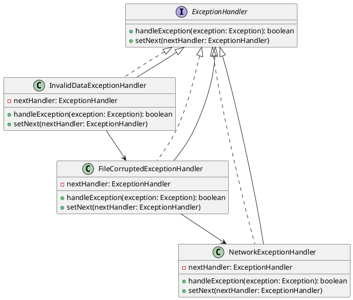

# PHP

Представьте, что вы работаете в команде разработчиков, которая занимается созданием и поддержкой веб-приложения. Ваш сеньор-разработчик поставил задачу: переделать обработку исключений для парсера данных. Ваша задача — сделать систему обработки исключений более гибкой и удобной для расширения. Для этого вы решили использовать паттерн "Цепочка обязанностей".

### Описание кейса

Ваш парсер данных обрабатывает различные типы данных и может вызывать разные исключения. Например, данные могут быть некорректными, файл может быть поврежден, или может возникнуть сетевая ошибка. Ваша цель — создать цепочку обработчиков, каждый из которых будет отвечать за обработку определенного типа исключений.

### UML диаграмма

<figure><figcaption><p>UML диаграмма для паттерна "Цепочка обязанностей"</p></figcaption></figure>



### Пример кода на PHP

**Интерфейс ExceptionHandler**


```php
<?php
interface ExceptionHandler {
    public function handleException(Exception $exception): bool;
    public function setNext(ExceptionHandler $nextHandler);
}
?>
```


**Абстрактный класс AbstractExceptionHandler**


```php
<?php
abstract class AbstractExceptionHandler implements ExceptionHandler {
    private $nextHandler;

    public function setNext(ExceptionHandler $nextHandler) {
        $this->nextHandler = $nextHandler;
    }

    public function handleException(Exception $exception): bool {
        if ($this->canHandle($exception)) {
            $this->process($exception);
            return true;
        }
        if ($this->nextHandler) {
            return $this->nextHandler->handleException($exception);
        }
        return false;
    }

    abstract protected function canHandle(Exception $exception): bool;
    abstract protected function process(Exception $exception);
}
?>
```


**Конкретный обработчик InvalidDataExceptionHandler**


```php
<?php
class InvalidDataExceptionHandler extends AbstractExceptionHandler {
    protected function canHandle(Exception $exception): bool {
        return $exception instanceof InvalidDataException;
    }

    protected function process(Exception $exception) {
        // Логика обработки исключения некорректных данных
        echo "Обработка исключения некорректных данных: " . $exception->getMessage() . "\n";
    }
}
?>
```


**Конкретный обработчик FileCorruptedExceptionHandler**


```php
<?php
class FileCorruptedExceptionHandler extends AbstractExceptionHandler {
    protected function canHandle(Exception $exception): bool {
        return $exception instanceof FileCorruptedException;
    }

    protected function process(Exception $exception) {
        // Логика обработки исключения поврежденного файла
        echo "Обработка исключения поврежденного файла: " . $exception->getMessage() . "\n";
    }
}
?>
```


**Конкретный обработчик NetworkExceptionHandler**


```php
<?php
class NetworkExceptionHandler extends AbstractExceptionHandler {
    protected function canHandle(Exception $exception): bool {
        return $exception instanceof NetworkException;
    }

    protected function process(Exception $exception) {
        // Логика обработки исключения сетевой ошибки
        echo "Обработка исключения сетевой ошибки: " . $exception->getMessage() . "\n";
    }
}
?>
```


**Использование цепочки обязанностей**


```php
<?php
// Определение пользовательских исключений
class InvalidDataException extends Exception {}
class FileCorruptedException extends Exception {}
class NetworkException extends Exception {}

// Создание цепочки обработчиков
$networkHandler = new NetworkExceptionHandler();
$fileHandler = new FileCorruptedExceptionHandler();
$invalidDataHandler = new InvalidDataExceptionHandler();

$invalidDataHandler->setNext($fileHandler);
$fileHandler->setNext($networkHandler);

// Пример использования
try {
    // Симуляция исключения
    throw new InvalidDataException("Некорректные данные");
} catch (Exception $e) {
    $invalidDataHandler->handleException($e);
}

try {
    // Симуляция исключения
    throw new FileCorruptedException("Файл поврежден");
} catch (Exception $e) {
    $invalidDataHandler->handleException($e);
}

try {
    // Симуляция исключения
    throw new NetworkException("Сетевая ошибка");
} catch (Exception $e) {
    $invalidDataHandler->handleException($e);
}
?>
```


### Объяснение кода

1. **Интерфейс ExceptionHandler**:
   * Определяет методы `handleException` и `setNext`, которые должны быть реализованы всеми обработчиками.
2. **Абстрактный класс AbstractExceptionHandler**:
   * Реализует метод `setNext` для установки следующего обработчика в цепочке.
   * Метод `handleException` проверяет, может ли текущий обработчик обработать исключение. Если нет, он передает исключение следующему обработчику.
   * Абстрактные методы `canHandle` и `process` должны быть реализованы в конкретных обработчиках.
3. **Конкретные обработчики**:
   * `InvalidDataExceptionHandler`, `FileCorruptedExceptionHandler`, `NetworkExceptionHandler` реализуют методы `canHandle` и `process` для обработки соответствующих типов исключений.
4. **Использование цепочки обязанностей**:
   * Создаются экземпляры обработчиков и устанавливается цепочка.
   * При возникновении исключения, оно передается в цепочку обработчиков, где каждый обработчик проверяет, может ли он обработать исключение.

### Вывод

Паттерн "Цепочка обязанностей" позволяет гибко и эффективно обрабатывать различные типы исключений в вашем парсере данных. Этот подход упрощает добавление новых обработчиков и делает код более читаемым и поддерживаемым. В данном кейсе мы показали, как можно использовать этот паттерн для обработки исключений некорректных данных, поврежденных файлов и сетевых ошибок.
