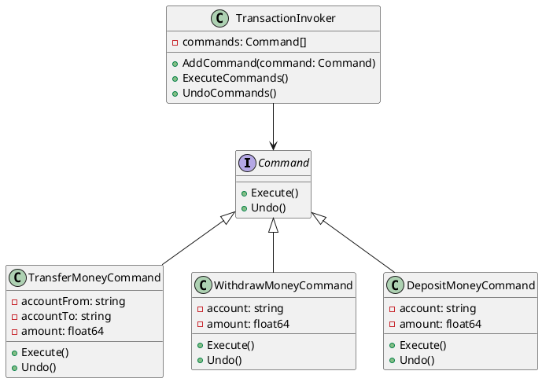

# Go

Представьте, что мы работаем в компании, которая разрабатывает программное обеспечение для управления финансовыми операциями. Наша задача — создать систему, которая позволяет выполнять различные транзакции в базе данных, такие как перевод денег между счетами, снятие наличных и пополнение счета. Мы хотим, чтобы наша система была гибкой и легко расширяемой, чтобы в будущем можно было добавлять новые типы транзакций без изменения существующего кода.

### Описание

Паттерн Команда (Command) позволяет инкапсулировать запрос на выполнение операции в виде объекта. Это позволяет параметризовать объекты с операциями, задавать очередь операций, хранить историю выполнения операций и поддерживать отмену операций.

### Пример кода на Go

**1. Интерфейс команды**


```go
package main

import "fmt"

type Command interface {
    Execute()
    Undo()
}
```


**2. Конкретные команды**


```go
package main

type TransferMoneyCommand struct {
    accountFrom string
    accountTo   string
    amount      float64
}

func (c *TransferMoneyCommand) Execute() {
    // Логика перевода денег
    fmt.Printf("Перевод %.2f с %s на %s\n", c.amount, c.accountFrom, c.accountTo)
}

func (c *TransferMoneyCommand) Undo() {
    // Логика отмены перевода
    fmt.Printf("Отмена перевода %.2f с %s на %s\n", c.amount, c.accountFrom, c.accountTo)
}

type WithdrawMoneyCommand struct {
    account string
    amount  float64
}

func (c *WithdrawMoneyCommand) Execute() {
    // Логика снятия денег
    fmt.Printf("Снятие %.2f с %s\n", c.amount, c.account)
}

func (c *WithdrawMoneyCommand) Undo() {
    // Логика отмены снятия
    fmt.Printf("Отмена снятия %.2f с %s\n", c.amount, c.account)
}

type DepositMoneyCommand struct {
    account string
    amount  float64
}

func (c *DepositMoneyCommand) Execute() {
    // Логика пополнения счета
    fmt.Printf("Пополнение %.2f на %s\n", c.amount, c.account)
}

func (c *DepositMoneyCommand) Undo() {
    // Логика отмены пополнения
    fmt.Printf("Отмена пополнения %.2f на %s\n", c.amount, c.account)
}
```


**3. Вызывающий объект (Invoker)**


```go
package main

type TransactionInvoker struct {
    commands []Command
}

func (i *TransactionInvoker) AddCommand(command Command) {
    i.commands = append(i.commands, command)
}

func (i *TransactionInvoker) ExecuteCommands() {
    for _, command := range i.commands {
        command.Execute()
    }
}

func (i *TransactionInvoker) UndoCommands() {
    for j := len(i.commands) - 1; j >= 0; j-- {
        i.commands[j].Undo()
    }
}
```


**4. Пример использования**


```go
package main

func main() {
    invoker := &TransactionInvoker{}

    transferCommand := &TransferMoneyCommand{accountFrom: "Account1", accountTo: "Account2", amount: 100}
    withdrawCommand := &WithdrawMoneyCommand{account: "Account1", amount: 50}
    depositCommand := &DepositMoneyCommand{account: "Account2", amount: 150}

    invoker.AddCommand(transferCommand)
    invoker.AddCommand(withdrawCommand)
    invoker.AddCommand(depositCommand)

    invoker.ExecuteCommands()
    invoker.UndoCommands()
}
```


### UML диаграмма

<figure><figcaption><p>UML диаграмма для паттерна "Команда"</p></figcaption></figure>





### Вывод для кейса

Использование паттерна Команда позволяет нам гибко управлять различными транзакциями в базе данных. Мы можем легко добавлять новые типы транзакций, не изменяя существующий код. Это делает нашу систему более модульной и удобной для расширения. Кроме того, паттерн Команда позволяет нам легко реализовать функции отмены операций, что является важным аспектом для финансовых систем.
