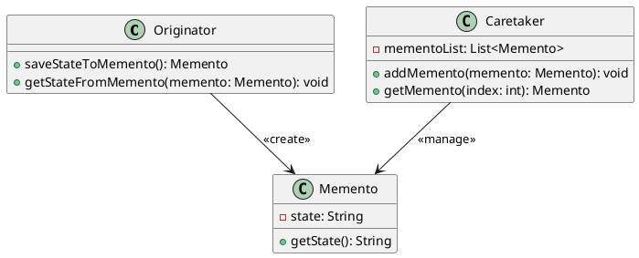

# Мнемонико (Memento)

### **Описание**

Паттерн "Мнемонико" (Memento) позволяет сохранять и восстанавливать внутреннее состояние объекта без нарушения его инкапсуляции. Это достигается за счет создания объекта-мнемонико, который хранит состояние объекта, и объекта-опекуна, который управляет мнемонико. Основная идея заключается в том, чтобы сохранить состояние объекта в мнемонико и восстановить его позже, когда это потребуется.

### **Принцип**

1. **Originator (Создатель)**: Создает объект-мнемонико, сохраняя свое текущее состояние.
2. **Memento (Мнемонико)**: Хранит состояние объекта.
3. **Caretaker (Опекун)**: Управляет мнемонико, сохраняя и восстанавливая состояние объекта.

### **UML диаграмма**

<figure><figcaption>
UML диаграмма для паттерна "Мнемонико"
</figcaption></figure>

### **Преимущества**

* **Сохранение состояния**: Позволяет сохранять и восстанавливать состояние объекта без нарушения его инкапсуляции.
* **Гибкость**: Легко добавлять и удалять состояния без изменения самого объекта.
* **Упрощение управления состоянием**: Упрощает управление состоянием объекта, особенно в сложных системах.

### **Недостатки**

* **Сложность**: Введение мнемонико может усложнить код.
* **Производительность**: Хранение и восстановление состояний может потребовать дополнительных ресурсов.

### **Применение**

* **Системы отмены действий**: Когда нужно реализовать функциональность отмены и повтора действий.
* **Системы управления состоянием**: Когда нужно управлять состоянием объектов в сложных системах.
* **Системы резервного копирования**: Когда нужно создавать резервные копии состояния объектов.

### **Примеры использования**

* **Текстовые редакторы**: В текстовых редакторах для реализации функций отмены и повтора действий.
* **Игры**: В играх для сохранения и загрузки состояния игры.
* **Системы управления транзакциями**: В системах управления транзакциями для отката к предыдущему состоянию.

Паттерн "Мнемонико" является мощным инструментом для управления состоянием объектов. Он широко используется в различных областях, таких как системы отмены действий, системы управления состоянием и системы резервного копирования.
