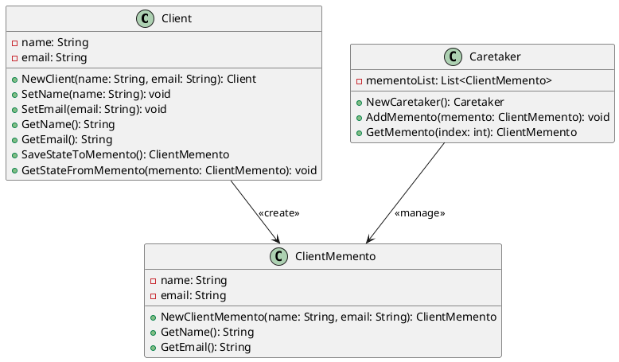

# Go

Мы — команда разработчиков, работающая над системой управления взаимоотношениями с клиентами (CRM). Наша задача — сделать работу с клиентами максимально удобной и эффективной. В этом кейсе мы рассмотрим, как применить паттерн "Мнемонико" (Memento) для реализации функции отмены действий в нашей CRM-системе. Это позволит пользователям отменять свои действия, такие как изменение данных клиента или создание новой записи, и возвращаться к предыдущему состоянию.

### Описание кейса

В нашей CRM-системе пользователи часто вносят изменения в данные клиентов. Иногда эти изменения могут быть ошибочными, и пользователи хотят вернуться к предыдущему состоянию. Паттерн "Мнемонико" позволяет сохранять состояние объекта и восстанавливать его позже без нарушения инкапсуляции.

### Применение паттерна

Мы будем использовать паттерн "Мнемонико" для сохранения состояния объекта "Клиент" перед внесением изменений. Если пользователь захочет отменить изменения, мы сможем восстановить предыдущее состояние объекта.

### Пример кода на Go

**Класс Client (Клиент)**


```go
package main

import "fmt"

type Client struct {
    name  string
    email string
}

func NewClient(name, email string) *Client {
    return &Client{name: name, email: email}
}

func (c *Client) SetName(name string) {
    c.name = name
}

func (c *Client) SetEmail(email string) {
    c.email = email
}

func (c *Client) GetName() string {
    return c.name
}

func (c *Client) GetEmail() string {
    return c.email
}

func (c *Client) SaveStateToMemento() *ClientMemento {
    return NewClientMemento(c.name, c.email)
}

func (c *Client) GetStateFromMemento(memento *ClientMemento) {
    c.name = memento.GetName()
    c.email = memento.GetEmail()
}
```


**Класс ClientMemento (Мнемонико Клиента)**


```go
type ClientMemento struct {
    name  string
    email string
}

func NewClientMemento(name, email string) *ClientMemento {
    return &ClientMemento{name: name, email: email}
}

func (m *ClientMemento) GetName() string {
    return m.name
}

func (m *ClientMemento) GetEmail() string {
    return m.email
}
```


**Класс Caretaker (Опекун)**


```go
type Caretaker struct {
    mementoList []*ClientMemento
}

func NewCaretaker() *Caretaker {
    return &Caretaker{mementoList: []*ClientMemento{}}
}

func (c *Caretaker) AddMemento(memento *ClientMemento) {
    c.mementoList = append(c.mementoList, memento)
}

func (c *Caretaker) GetMemento(index int) *ClientMemento {
    return c.mementoList[index]
}
```


#### Пример использования


```go
func main() {
    // Создаем объект клиента
    client := NewClient("Иван Иванов", "ivan@example.com")

    // Создаем объект опекуна
    caretaker := NewCaretaker()

    // Сохраняем текущее состояние клиента
    caretaker.AddMemento(client.SaveStateToMemento())

    // Изменяем данные клиента
    client.SetName("Петр Петров")
    client.SetEmail("petr@example.com")

    // Сохраняем новое состояние клиента
    caretaker.AddMemento(client.SaveStateToMemento())

    // Восстанавливаем предыдущее состояние клиента
    client.GetStateFromMemento(caretaker.GetMemento(0))

    // Выводим данные клиента
    fmt.Println("Имя:", client.GetName())
    fmt.Println("Email:", client.GetEmail())
}
```


### UML диаграмма

<figure><figcaption><p>UML диаграмма для паттерна "Мнемонико"</p></figcaption></figure>





### Вывод для кейса

Паттерн "Мнемонико" позволяет нам эффективно управлять состоянием объектов в нашей CRM-системе. Мы можем сохранять состояние объекта перед внесением изменений и восстанавливать его позже, если это необходимо. Это делает нашу систему более гибкой и удобной для пользователей, позволяя им отменять свои действия и возвращаться к предыдущему состоянию.

Надеюсь, этот кейс поможет вам лучше понять, как применять паттерн "Мнемонико" в реальных проектах.
