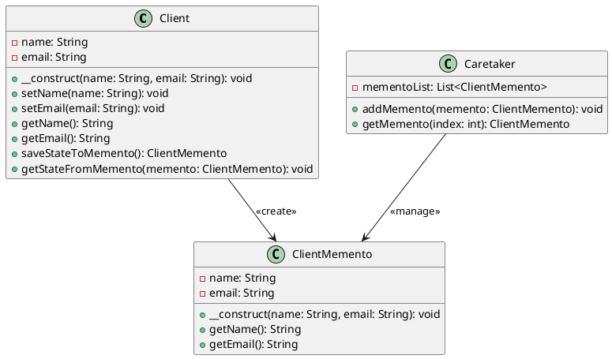

# PHP

Мы — команда разработчиков, работающая над системой управления взаимоотношениями с клиентами (CRM). Наша задача — сделать работу с клиентами максимально удобной и эффективной. В этом кейсе мы рассмотрим, как применить паттерн "Мнемонико" (Memento) для реализации функции отмены действий в нашей CRM-системе. Это позволит пользователям отменять свои действия, такие как изменение данных клиента или создание новой записи, и возвращаться к предыдущему состоянию.

### Описание кейса

В нашей CRM-системе пользователи часто вносят изменения в данные клиентов. Иногда эти изменения могут быть ошибочными, и пользователи хотят вернуться к предыдущему состоянию. Паттерн "Мнемонико" позволяет сохранять состояние объекта и восстанавливать его позже без нарушения инкапсуляции.

### Применение паттерна

Мы будем использовать паттерн "Мнемонико" для сохранения состояния объекта "Клиент" перед внесением изменений. Если пользователь захочет отменить изменения, мы сможем восстановить предыдущее состояние объекта.

### Пример кода на PHP

**Класс Client (Клиент)**


```php
class Client {
    private $name;
    private $email;

    public function __construct($name, $email) {
        $this->name = $name;
        $this->email = $email;
    }

    public function setName($name) {
        $this->name = $name;
    }

    public function setEmail($email) {
        $this->email = $email;
    }

    public function getName() {
        return $this->name;
    }

    public function getEmail() {
        return $this->email;
    }

    public function saveStateToMemento() {
        return new ClientMemento($this->name, $this->email);
    }

    public function getStateFromMemento(ClientMemento $memento) {
        $this->name = $memento->getName();
        $this->email = $memento->getEmail();
    }
}
```


**Класс ClientMemento (Мнемонико Клиента)**


```php
class ClientMemento {
    private $name;
    private $email;

    public function __construct($name, $email) {
        $this->name = $name;
        $this->email = $email;
    }

    public function getName() {
        return $this->name;
    }

    public function getEmail() {
        return $this->email;
    }
}
```


**Класс Caretaker (Опекун)**


```php
class Caretaker {
    private $mementoList = [];

    public function addMemento(ClientMemento $memento) {
        $this->mementoList[] = $memento;
    }

    public function getMemento($index) {
        return $this->mementoList[$index];
    }
}
```


#### Пример использования


```php
// Создаем объект клиента
$client = new Client("Иван Иванов", "ivan@example.com");

// Создаем объект опекуна
$caretaker = new Caretaker();

// Сохраняем текущее состояние клиента
$caretaker->addMemento($client->saveStateToMemento());

// Изменяем данные клиента
$client->setName("Петр Петров");
$client->setEmail("petr@example.com");

// Сохраняем новое состояние клиента
$caretaker->addMemento($client->saveStateToMemento());

// Восстанавливаем предыдущее состояние клиента
$client->getStateFromMemento($caretaker->getMemento(0));

// Выводим данные клиента
echo "Имя: " . $client->getName() . "\n";
echo "Email: " . $client->getEmail() . "\n";
```


### UML диаграмма

<figure><figcaption><p>UML диаграмма для паттерна "Мнемонико"</p></figcaption></figure>





### Вывод для кейса

Паттерн "Мнемонико" позволяет нам эффективно управлять состоянием объектов в нашей CRM-системе. Мы можем сохранять состояние объекта перед внесением изменений и восстанавливать его позже, если это необходимо. Это делает нашу систему более гибкой и удобной для пользователей, позволяя им отменять свои действия и возвращаться к предыдущему состоянию.

Надеюсь, этот кейс поможет вам лучше понять, как применять паттерн "Мнемонико" в реальных проектах.
