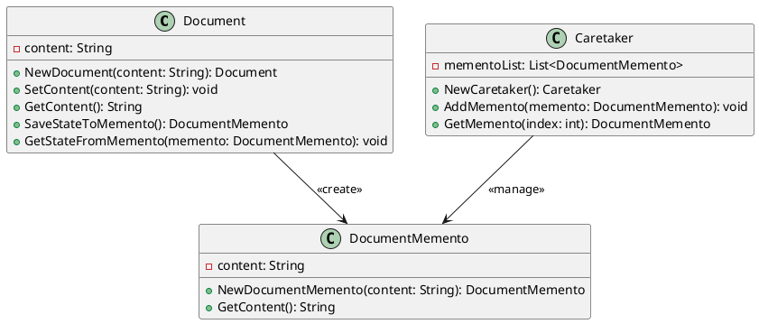

# Go

Мы — команда разработчиков, работающая над системой управления документами. Наша задача — сделать работу с документами максимально удобной и эффективной. В этом кейсе мы рассмотрим, как применить паттерн "Мнемонико" (Memento) для реализации системы управления версиями документов. Это позволит пользователям сохранять различные версии документов и восстанавливать их при необходимости.

### Описание кейса

В нашей системе управления документами пользователи часто вносят изменения в документы. Иногда эти изменения могут быть ошибочными, и пользователи хотят вернуться к предыдущей версии документа. Паттерн "Мнемонико" позволяет сохранять состояние объекта (в данном случае — документа) и восстанавливать его позже без нарушения инкапсуляции.

### Применение паттерна

Мы будем использовать паттерн "Мнемонико" для сохранения состояния объекта "Документ" перед внесением изменений. Если пользователь захочет отменить изменения, мы сможем восстановить предыдущее состояние объекта.

#### Пример кода на Go

**Класс Document (Документ)**


```go
package main

import "fmt"

type Document struct {
    content string
}

func NewDocument(content string) *Document {
    return &Document{content: content}
}

func (d *Document) SetContent(content string) {
    d.content = content
}

func (d *Document) GetContent() string {
    return d.content
}

func (d *Document) SaveStateToMemento() *DocumentMemento {
    return NewDocumentMemento(d.content)
}

func (d *Document) GetStateFromMemento(memento *DocumentMemento) {
    d.content = memento.GetContent()
}
```


**Класс DocumentMemento (Мнемонико Документа)**


```go
type DocumentMemento struct {
    content string
}

func NewDocumentMemento(content string) *DocumentMemento {
    return &DocumentMemento{content: content}
}

func (m *DocumentMemento) GetContent() string {
    return m.content
}
```


**Класс Caretaker (Опекун)**


```go
type Caretaker struct {
    mementoList []*DocumentMemento
}

func NewCaretaker() *Caretaker {
    return &Caretaker{mementoList: []*DocumentMemento{}}
}

func (c *Caretaker) AddMemento(memento *DocumentMemento) {
    c.mementoList = append(c.mementoList, memento)
}

func (c *Caretaker) GetMemento(index int) *DocumentMemento {
    return c.mementoList[index]
}
```


#### Пример использования


```go
func main() {
    // Создаем объект документа
    document := NewDocument("Первая версия документа")

    // Создаем объект опекуна
    caretaker := NewCaretaker()

    // Сохраняем текущее состояние документа
    caretaker.AddMemento(document.SaveStateToMemento())

    // Изменяем содержимое документа
    document.SetContent("Вторая версия документа")

    // Сохраняем новое состояние документа
    caretaker.AddMemento(document.SaveStateToMemento())

    // Восстанавливаем предыдущее состояние документа
    document.GetStateFromMemento(caretaker.GetMemento(0))

    // Выводим содержимое документа
    fmt.Println("Содержимое документа:", document.GetContent())
}
```


### UML диаграмма

<figure><figcaption><p>UML диаграмма для паттерна "Мнемонико"</p></figcaption></figure>





### Вывод для кейса

Паттерн "Мнемонико" позволяет нам эффективно управлять состоянием объектов в нашей системе управления документами. Мы можем сохранять состояние объекта перед внесением изменений и восстанавливать его позже, если это необходимо. Это делает нашу систему более гибкой и удобной для пользователей, позволяя им отменять свои действия и возвращаться к предыдущему состоянию документа.

Надеюсь, этот кейс поможет вам лучше понять, как применять паттерн "Мнемонико" в реальных проектах.
