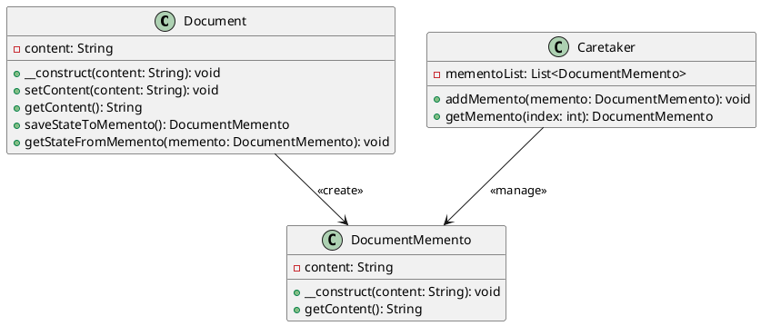

# PHP

Мы — команда разработчиков, работающая над системой управления документами. Наша задача — сделать работу с документами максимально удобной и эффективной. В этом кейсе мы рассмотрим, как применить паттерн "Мнемонико" (Memento) для реализации системы управления версиями документов. Это позволит пользователям сохранять различные версии документов и восстанавливать их при необходимости.

### Описание кейса

В нашей системе управления документами пользователи часто вносят изменения в документы. Иногда эти изменения могут быть ошибочными, и пользователи хотят вернуться к предыдущей версии документа. Паттерн "Мнемонико" позволяет сохранять состояние объекта (в данном случае — документа) и восстанавливать его позже без нарушения инкапсуляции.

### Применение паттерна

Мы будем использовать паттерн "Мнемонико" для сохранения состояния объекта "Документ" перед внесением изменений. Если пользователь захочет отменить изменения, мы сможем восстановить предыдущее состояние объекта.

#### Пример кода на PHP

**Класс Document (Документ)**


```php
class Document {
    private $content;

    public function __construct($content) {
        $this->content = $content;
    }

    public function setContent($content) {
        $this->content = $content;
    }

    public function getContent() {
        return $this->content;
    }

    public function saveStateToMemento() {
        return new DocumentMemento($this->content);
    }

    public function getStateFromMemento(DocumentMemento $memento) {
        $this->content = $memento->getContent();
    }
}
```


**Класс DocumentMemento (Мнемонико Документа)**


```php
class DocumentMemento {
    private $content;

    public function __construct($content) {
        $this->content = $content;
    }

    public function getContent() {
        return $this->content;
    }
}
```


**Класс Caretaker (Опекун)**


```php
class Caretaker {
    private $mementoList = [];

    public function addMemento(DocumentMemento $memento) {
        $this->mementoList[] = $memento;
    }

    public function getMemento($index) {
        return $this->mementoList[$index];
    }
}
```


#### Пример использования


```php
// Создаем объект документа
$document = new Document("Первая версия документа");

// Создаем объект опекуна
$caretaker = new Caretaker();

// Сохраняем текущее состояние документа
$caretaker->addMemento($document->saveStateToMemento());

// Изменяем содержимое документа
$document->setContent("Вторая версия документа");

// Сохраняем новое состояние документа
$caretaker->addMemento($document->saveStateToMemento());

// Восстанавливаем предыдущее состояние документа
$document->getStateFromMemento($caretaker->getMemento(0));

// Выводим содержимое документа
echo "Содержимое документа: " . $document->getContent() . "\n";
```


### UML диаграмма

<figure><figcaption><p>UML диаграмма для паттерна "Мнемонико"</p></figcaption></figure>





### Вывод для кейса

Паттерн "Мнемонико" позволяет нам эффективно управлять состоянием объектов в нашей системе управления документами. Мы можем сохранять состояние объекта перед внесением изменений и восстанавливать его позже, если это необходимо. Это делает нашу систему более гибкой и удобной для пользователей, позволяя им отменять свои действия и возвращаться к предыдущему состоянию документа.

Надеюсь, этот кейс поможет вам лучше понять, как применять паттерн "Мнемонико" в реальных проектах. Удачи в разработке!
