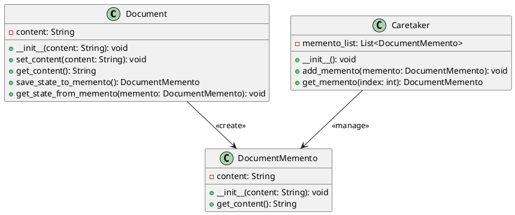

# Python

Мы — команда разработчиков, работающая над системой управления документами. Наша задача — сделать работу с документами максимально удобной и эффективной. В этом кейсе мы рассмотрим, как применить паттерн "Мнемонико" (Memento) для реализации системы управления версиями документов. Это позволит пользователям сохранять различные версии документов и восстанавливать их при необходимости.

### Описание кейса

В нашей системе управления документами пользователи часто вносят изменения в документы. Иногда эти изменения могут быть ошибочными, и пользователи хотят вернуться к предыдущей версии документа. Паттерн "Мнемонико" позволяет сохранять состояние объекта (в данном случае — документа) и восстанавливать его позже без нарушения инкапсуляции.

### Применение паттерна

Мы будем использовать паттерн "Мнемонико" для сохранения состояния объекта "Документ" перед внесением изменений. Если пользователь захочет отменить изменения, мы сможем восстановить предыдущее состояние объекта.

#### Пример кода на Python

**Класс Document (Документ)**


```python
class Document:
    def __init__(self, content):
        self.content = content

    def set_content(self, content):
        self.content = content

    def get_content(self):
        return self.content

    def save_state_to_memento(self):
        return DocumentMemento(self.content)

    def get_state_from_memento(self, memento):
        self.content = memento.get_content()
```


**Класс DocumentMemento (Мнемонико Документа)**


```python
class DocumentMemento:
    def __init__(self, content):
        self.content = content

    def get_content(self):
        return self.content
```


**Класс Caretaker (Опекун)**


```python
class Caretaker:
    def __init__(self):
        self.memento_list = []

    def add_memento(self, memento):
        self.memento_list.append(memento)

    def get_memento(self, index):
        return self.memento_list[index]
```


#### Пример использования


```python
if __name__ == "__main__":
    # Создаем объект документа
    document = Document("Первая версия документа")

    # Создаем объект опекуна
    caretaker = Caretaker()

    # Сохраняем текущее состояние документа
    caretaker.add_memento(document.save_state_to_memento())

    # Изменяем содержимое документа
    document.set_content("Вторая версия документа")

    # Сохраняем новое состояние документа
    caretaker.add_memento(document.save_state_to_memento())

    # Восстанавливаем предыдущее состояние документа
    document.get_state_from_memento(caretaker.get_memento(0))

    # Выводим содержимое документа
    print("Содержимое документа:", document.get_content())
```


### UML диаграмма

<figure><figcaption><p>UML диаграмма для паттерна "Мнемонико"</p></figcaption></figure>





### Вывод для кейса

Паттерн "Мнемонико" позволяет нам эффективно управлять состоянием объектов в нашей системе управления документами. Мы можем сохранять состояние объекта перед внесением изменений и восстанавливать его позже, если это необходимо. Это делает нашу систему более гибкой и удобной для пользователей, позволяя им отменять свои действия и возвращаться к предыдущему состоянию документа.

Надеюсь, этот кейс поможет вам лучше понять, как применять паттерн "Мнемонико" в реальных проектах.
