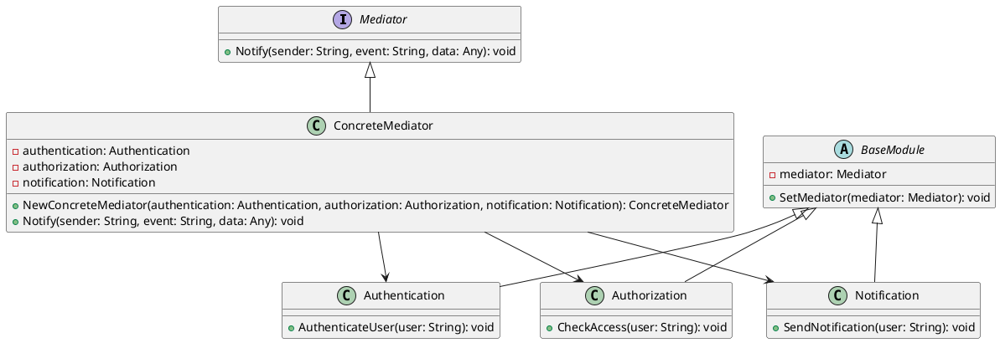

# Go

Мы — команда разработчиков, создающих систему управления пользователями. Наша цель — сделать так, чтобы все компоненты системы могли легко и эффективно взаимодействовать друг с другом. Для этого мы используем паттерн проектирования "Посредник" (Mediator). Этот паттерн помогает уменьшить зависимости между объектами, позволяя им общаться через посредника, а не напрямую.

### Описание кейса

В нашей системе управления пользователями есть несколько компонентов: модуль аутентификации, модуль авторизации и модуль уведомлений. Каждый из этих модулей выполняет свои задачи и должен быть в курсе того, что делают другие. Например, после успешной аутентификации пользователя, модуль авторизации должен проверить его права доступа, а модуль уведомлений должен отправить уведомление. Без посредника все эти модули должны были бы напрямую общаться друг с другом, что привело бы к сложной и запутанной системе.

### Применение паттерна "Посредник"

Паттерн "Посредник" позволяет нам создать центральный объект, который будет координировать взаимодействие между всеми модулями. Это упрощает коммуникацию и делает систему более гибкой и легкой в поддержке.

### Пример кода на Go

**1. Интерфейс Посредника**


```go
package main

type Mediator interface {
    Notify(sender string, event string, data interface{})
}
```


**2. Конкретный Посредник**


```go
package main

type ConcreteMediator struct {
    authentication *Authentication
    authorization *Authorization
    notification  *Notification
}

func NewConcreteMediator(authentication *Authentication, authorization *Authorization, notification *Notification) *ConcreteMediator {
    mediator := &ConcreteMediator{
        authentication: authentication,
        authorization:  authorization,
        notification:   notification,
    }
    authentication.SetMediator(mediator)
    authorization.SetMediator(mediator)
    notification.SetMediator(mediator)
    return mediator
}

func (m *ConcreteMediator) Notify(sender string, event string, data interface{}) {
    if sender == "Authentication" {
        if event == "UserAuthenticated" {
            m.authorization.CheckAccess(data)
            m.notification.SendNotification(data)
        }
    } else if sender == "Authorization" {
        if event == "AccessGranted" {
            m.notification.SendNotification(data)
        }
    }
}
```


**3. Базовый класс модуля**


```go
package main

type BaseModule struct {
    mediator Mediator
}

func (m *BaseModule) SetMediator(mediator Mediator) {
    m.mediator = mediator
}
```


**4. Класс Аутентификации**


```go
package main

import "fmt"

type Authentication struct {
    BaseModule
}

func (a *Authentication) AuthenticateUser(user string) {
    // Логика аутентификации пользователя
    fmt.Printf("Authentication: Authenticating user: %s\n", user)
    a.mediator.Notify("Authentication", "UserAuthenticated", user)
}
```


**5. Класс Авторизации**


```go
package main

import "fmt"

type Authorization struct {
    BaseModule
}

func (a *Authorization) CheckAccess(user string) {
    // Логика проверки доступа пользователя
    fmt.Printf("Authorization: Checking access for user: %s\n", user)
    a.mediator.Notify("Authorization", "AccessGranted", user)
}
```


**6. Класс Уведомлений**


```go
package main

import "fmt"

type Notification struct {
    BaseModule
}

func (n *Notification) SendNotification(user string) {
    // Логика отправки уведомления пользователю
    fmt.Printf("Notification: Sending notification to user: %s\n", user)
}
```


#### Пример использования


```go
package main

func main() {
    authentication := &Authentication{}
    authorization := &Authorization{}
    notification := &Notification{}

    mediator := NewConcreteMediator(authentication, authorization, notification)

    authentication.AuthenticateUser("User1")
}
```


### UML диаграмма

<figure><figcaption><p>UML диаграмма для паттерна "Посредник"</p></figcaption></figure>





### Вывод для кейса

Использование паттерна "Посредник" в нашей системе управления пользователями позволяет значительно упростить взаимодействие между различными модулями. Вместо того чтобы каждый модуль общался напрямую с другими, все взаимодействия проходят через центральный объект — посредника. Это делает систему более гибкой, легкой в поддержке и расширении. Модули аутентификации, авторизации и уведомлений могут сосредоточиться на своих задачах, не беспокоясь о том, как именно они будут взаимодействовать друг с другом.
