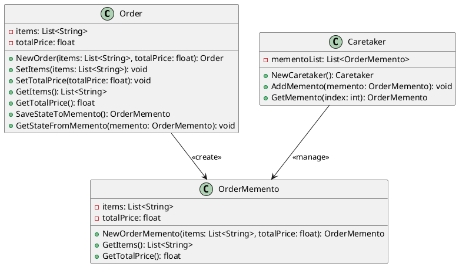

# Go

Мы — команда разработчиков, работающая над системой управления заказами в интернет-магазине. Наша задача — сделать процесс обработки заказов максимально удобным и эффективным. В этом кейсе мы рассмотрим, как применить паттерн "Мнемонико" (Memento) для реализации функции отмены действий в нашей системе управления заказами. Это позволит пользователям отменять свои действия, такие как изменение данных заказа или добавление новых товаров, и возвращаться к предыдущему состоянию.

### Описание кейса

В нашей системе управления заказами пользователи часто вносят изменения в заказы. Иногда эти изменения могут быть ошибочными, и пользователи хотят вернуться к предыдущему состоянию заказа. Паттерн "Мнемонико" позволяет сохранять состояние объекта (в данном случае — заказа) и восстанавливать его позже без нарушения инкапсуляции.

### Применение паттерна

Мы будем использовать паттерн "Мнемонико" для сохранения состояния объекта "Заказ" перед внесением изменений. Если пользователь захочет отменить изменения, мы сможем восстановить предыдущее состояние объекта.

### Пример кода на Go

**Класс Order (Заказ)**


```go
package main

import "fmt"

type Order struct {
    items      []string
    totalPrice float64
}

func NewOrder(items []string, totalPrice float64) *Order {
    return &Order{items: items, totalPrice: totalPrice}
}

func (o *Order) SetItems(items []string) {
    o.items = items
}

func (o *Order) SetTotalPrice(totalPrice float64) {
    o.totalPrice = totalPrice
}

func (o *Order) GetItems() []string {
    return o.items
}

func (o *Order) GetTotalPrice() float64 {
    return o.totalPrice
}

func (o *Order) SaveStateToMemento() *OrderMemento {
    return NewOrderMemento(o.items, o.totalPrice)
}

func (o *Order) GetStateFromMemento(memento *OrderMemento) {
    o.items = memento.GetItems()
    o.totalPrice = memento.GetTotalPrice()
}
```


**Класс OrderMemento (Мнемонико Заказа)**


```go
type OrderMemento struct {
    items      []string
    totalPrice float64
}

func NewOrderMemento(items []string, totalPrice float64) *OrderMemento {
    return &OrderMemento{items: items, totalPrice: totalPrice}
}

func (m *OrderMemento) GetItems() []string {
    return m.items
}

func (m *OrderMemento) GetTotalPrice() float64 {
    return m.totalPrice
}
```


**Класс Caretaker (Опекун)**


```go
type Caretaker struct {
    mementoList []*OrderMemento
}

func NewCaretaker() *Caretaker {
    return &Caretaker{mementoList: []*OrderMemento{}}
}

func (c *Caretaker) AddMemento(memento *OrderMemento) {
    c.mementoList = append(c.mementoList, memento)
}

func (c *Caretaker) GetMemento(index int) *OrderMemento {
    return c.mementoList[index]
}
```


#### Пример использования


```go
func main() {
    // Создаем объект заказа
    order := NewOrder([]string{"Товар 1", "Товар 2"}, 100.0)

    // Создаем объект опекуна
    caretaker := NewCaretaker()

    // Сохраняем текущее состояние заказа
    caretaker.AddMemento(order.SaveStateToMemento())

    // Изменяем данные заказа
    order.SetItems([]string{"Товар 3", "Товар 4"})
    order.SetTotalPrice(200.0)

    // Сохраняем новое состояние заказа
    caretaker.AddMemento(order.SaveStateToMemento())

    // Восстанавливаем предыдущее состояние заказа
    order.GetStateFromMemento(caretaker.GetMemento(0))

    // Выводим данные заказа
    fmt.Println("Товары:", order.GetItems())
    fmt.Println("Общая стоимость:", order.GetTotalPrice())
}
```


### UML диаграмма

<figure><figcaption><p>UML диаграмма для паттерна "Мнемонико"</p></figcaption></figure>





### Вывод для кейса

Паттерн "Мнемонико" позволяет нам эффективно управлять состоянием объектов в нашей системе управления заказами. Мы можем сохранять состояние объекта перед внесением изменений и восстанавливать его позже, если это необходимо. Это делает нашу систему более гибкой и удобной для пользователей, позволяя им отменять свои действия и возвращаться к предыдущему состоянию заказа.

Надеюсь, этот кейс поможет вам лучше понять, как применять паттерн "Мнемонико" в реальных проектах.
