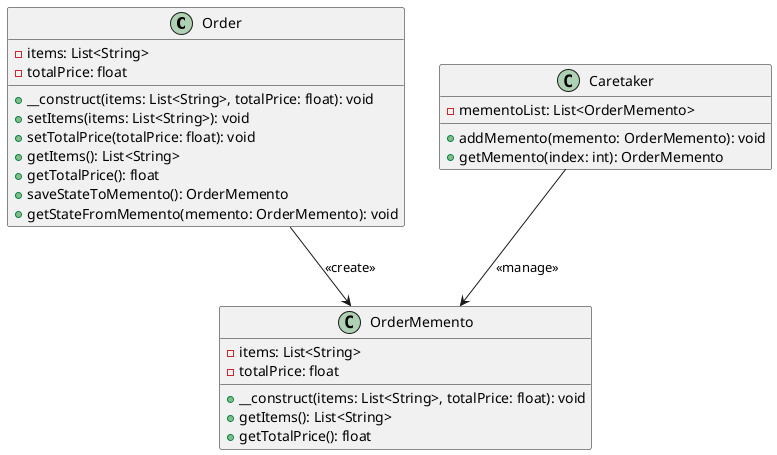

# PHP

Мы — команда разработчиков, работающая над системой управления заказами в интернет-магазине. Наша задача — сделать процесс обработки заказов максимально удобным и эффективным. В этом кейсе мы рассмотрим, как применить паттерн "Мнемонико" (Memento) для реализации функции отмены действий в нашей системе управления заказами. Это позволит пользователям отменять свои действия, такие как изменение данных заказа или добавление новых товаров, и возвращаться к предыдущему состоянию.

### Описание кейса

В нашей системе управления заказами пользователи часто вносят изменения в заказы. Иногда эти изменения могут быть ошибочными, и пользователи хотят вернуться к предыдущему состоянию заказа. Паттерн "Мнемонико" позволяет сохранять состояние объекта (в данном случае — заказа) и восстанавливать его позже без нарушения инкапсуляции.

### Применение паттерна

Мы будем использовать паттерн "Мнемонико" для сохранения состояния объекта "Заказ" перед внесением изменений. Если пользователь захочет отменить изменения, мы сможем восстановить предыдущее состояние объекта.

### Пример кода на PHP

**Класс Order (Заказ)**


```php
class Order {
    private $items;
    private $totalPrice;

    public function __construct($items, $totalPrice) {
        $this->items = $items;
        $this->totalPrice = $totalPrice;
    }

    public function setItems($items) {
        $this->items = $items;
    }

    public function setTotalPrice($totalPrice) {
        $this->totalPrice = $totalPrice;
    }

    public function getItems() {
        return $this->items;
    }

    public function getTotalPrice() {
        return $this->totalPrice;
    }

    public function saveStateToMemento() {
        return new OrderMemento($this->items, $this->totalPrice);
    }

    public function getStateFromMemento(OrderMemento $memento) {
        $this->items = $memento->getItems();
        $this->totalPrice = $memento->getTotalPrice();
    }
}
```


**Класс OrderMemento (Мнемонико Заказа)**


```php
class OrderMemento {
    private $items;
    private $totalPrice;

    public function __construct($items, $totalPrice) {
        $this->items = $items;
        $this->totalPrice = $totalPrice;
    }

    public function getItems() {
        return $this->items;
    }

    public function getTotalPrice() {
        return $this->totalPrice;
    }
}
```


**Класс Caretaker (Опекун)**


```php
class Caretaker {
    private $mementoList = [];

    public function addMemento(OrderMemento $memento) {
        $this->mementoList[] = $memento;
    }

    public function getMemento($index) {
        return $this->mementoList[$index];
    }
}
```


#### Пример использования


```php
// Создаем объект заказа
$order = new Order(["Товар 1", "Товар 2"], 100);

// Создаем объект опекуна
$caretaker = new Caretaker();

// Сохраняем текущее состояние заказа
$caretaker->addMemento($order->saveStateToMemento());

// Изменяем данные заказа
$order->setItems(["Товар 3", "Товар 4"]);
$order->setTotalPrice(200);

// Сохраняем новое состояние заказа
$caretaker->addMemento($order->saveStateToMemento());

// Восстанавливаем предыдущее состояние заказа
$order->getStateFromMemento($caretaker->getMemento(0));

// Выводим данные заказа
echo "Товары: " . implode(", ", $order->getItems()) . "\n";
echo "Общая стоимость: " . $order->getTotalPrice() . "\n";
```


### UML диаграмма

<figure><figcaption><p>UML диаграмма для паттерна "Мнемонико"</p></figcaption></figure>





### Вывод для кейса

Паттерн "Мнемонико" позволяет нам эффективно управлять состоянием объектов в нашей системе управления заказами. Мы можем сохранять состояние объекта перед внесением изменений и восстанавливать его позже, если это необходимо. Это делает нашу систему более гибкой и удобной для пользователей, позволяя им отменять свои действия и возвращаться к предыдущему состоянию заказа.

Надеюсь, этот кейс поможет вам лучше понять, как применять паттерн "Мнемонико" в реальных проектах.
