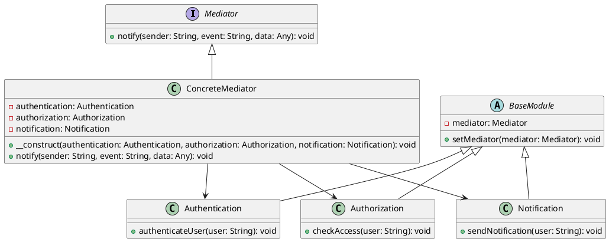

# PHP

Мы — команда разработчиков, создающих систему управления пользователями. Наша цель — сделать так, чтобы все компоненты системы могли легко и эффективно взаимодействовать друг с другом. Для этого мы используем паттерн проектирования "Посредник" (Mediator). Этот паттерн помогает уменьшить зависимости между объектами, позволяя им общаться через посредника, а не напрямую.

### Описание кейса

В нашей системе управления пользователями есть несколько компонентов: модуль аутентификации, модуль авторизации и модуль уведомлений. Каждый из этих модулей выполняет свои задачи и должен быть в курсе того, что делают другие. Например, после успешной аутентификации пользователя, модуль авторизации должен проверить его права доступа, а модуль уведомлений должен отправить уведомление. Без посредника все эти модули должны были бы напрямую общаться друг с другом, что привело бы к сложной и запутанной системе.

### Применение паттерна "Посредник"

Паттерн "Посредник" позволяет нам создать центральный объект, который будет координировать взаимодействие между всеми модулями. Это упрощает коммуникацию и делает систему более гибкой и легкой в поддержке.

### Пример кода на PHP

**1. Интерфейс Посредника**


```php
interface Mediator {
    public function notify(string $sender, string $event, $data = null);
}
```


**2. Конкретный Посредник**


```php
class ConcreteMediator implements Mediator {
    private $authentication;
    private $authorization;
    private $notification;

    public function __construct(Authentication $authentication, Authorization $authorization, Notification $notification) {
        $this->authentication = $authentication;
        $this->authorization = $authorization;
        $this->notification = $notification;

        $this->authentication->setMediator($this);
        $this->authorization->setMediator($this);
        $this->notification->setMediator($this);
    }

    public function notify(string $sender, string $event, $data = null) {
        if ($sender === 'Authentication') {
            if ($event === 'UserAuthenticated') {
                $this->authorization->checkAccess($data);
                $this->notification->sendNotification($data);
            }
        } elseif ($sender === 'Authorization') {
            if ($event === 'AccessGranted') {
                $this->notification->sendNotification($data);
            }
        }
    }
}
```


**3. Базовый класс модуля**


```php
abstract class BaseModule {
    protected $mediator;

    public function setMediator(Mediator $mediator) {
        $this->mediator = $mediator;
    }
}
```


**4. Класс Аутентификации**


```php
class Authentication extends BaseModule {
    public function authenticateUser($user) {
        // Логика аутентификации пользователя
        $this->mediator->notify('Authentication', 'UserAuthenticated', $user);
    }
}
```


**5. Класс Авторизации**


```php
class Authorization extends BaseModule {
    public function checkAccess($user) {
        // Логика проверки доступа пользователя
        echo "Authorization: Checking access for user: $user\n";
        $this->mediator->notify('Authorization', 'AccessGranted', $user);
    }
}
```


**6. Класс Уведомлений**


```php
class Notification extends BaseModule {
    public function sendNotification($user) {
        // Логика отправки уведомления пользователю
        echo "Notification: Sending notification to user: $user\n";
    }
}
```


#### Пример использования


```php
$authentication = new Authentication();
$authorization = new Authorization();
$notification = new Notification();

$mediator = new ConcreteMediator($authentication, $authorization, $notification);

$authentication->authenticateUser('User1');
```


### UML диаграмма

<figure><figcaption><p>UML диаграмма для паттерна "Посредник"</p></figcaption></figure>





### Вывод для кейса

Использование паттерна "Посредник" в нашей системе управления пользователями позволяет значительно упростить взаимодействие между различными модулями. Вместо того чтобы каждый модуль общался напрямую с другими, все взаимодействия проходят через центральный объект — посредника. Это делает систему более гибкой, легкой в поддержке и расширении. Модули аутентификации, авторизации и уведомлений могут сосредоточиться на своих задачах, не беспокоясь о том, как именно они будут взаимодействовать друг с другом.
