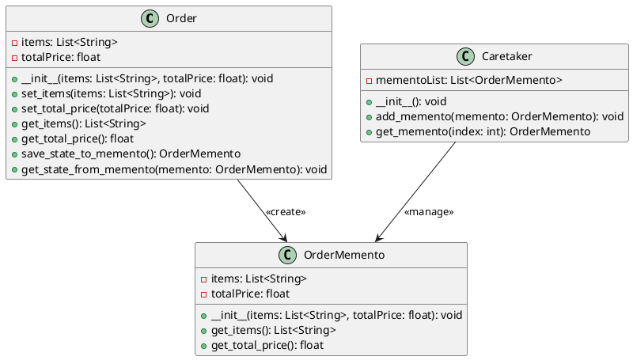

# Python

Мы — команда разработчиков, работающая над системой управления заказами в интернет-магазине. Наша задача — сделать процесс обработки заказов максимально удобным и эффективным. В этом кейсе мы рассмотрим, как применить паттерн "Мнемонико" (Memento) для реализации функции отмены действий в нашей системе управления заказами. Это позволит пользователям отменять свои действия, такие как изменение данных заказа или добавление новых товаров, и возвращаться к предыдущему состоянию.

### Описание кейса

В нашей системе управления заказами пользователи часто вносят изменения в заказы. Иногда эти изменения могут быть ошибочными, и пользователи хотят вернуться к предыдущему состоянию заказа. Паттерн "Мнемонико" позволяет сохранять состояние объекта (в данном случае — заказа) и восстанавливать его позже без нарушения инкапсуляции.

### Применение паттерна

Мы будем использовать паттерн "Мнемонико" для сохранения состояния объекта "Заказ" перед внесением изменений. Если пользователь захочет отменить изменения, мы сможем восстановить предыдущее состояние объекта.

### Пример кода на Python

**Класс Order (Заказ)**


```python
class Order:
    def __init__(self, items, total_price):
        self.items = items
        self.total_price = total_price

    def set_items(self, items):
        self.items = items

    def set_total_price(self, total_price):
        self.total_price = total_price

    def get_items(self):
        return self.items

    def get_total_price(self):
        return self.total_price

    def save_state_to_memento(self):
        return OrderMemento(self.items, self.total_price)

    def get_state_from_memento(self, memento):
        self.items = memento.get_items()
        self.total_price = memento.get_total_price()
```


**Класс OrderMemento (Мнемонико Заказа)**


```python
class OrderMemento:
    def __init__(self, items, total_price):
        self.items = items
        self.total_price = total_price

    def get_items(self):
        return self.items

    def get_total_price(self):
        return self.total_price
```


**Класс Caretaker (Опекун)**


```python
class Caretaker:
    def __init__(self):
        self.memento_list = []

    def add_memento(self, memento):
        self.memento_list.append(memento)

    def get_memento(self, index):
        return self.memento_list[index]
```


#### Пример использования


```python
if __name__ == "__main__":
    # Создаем объект заказа
    order = Order(["Товар 1", "Товар 2"], 100.0)

    # Создаем объект опекуна
    caretaker = Caretaker()

    # Сохраняем текущее состояние заказа
    caretaker.add_memento(order.save_state_to_memento())

    # Изменяем данные заказа
    order.set_items(["Товар 3", "Товар 4"])
    order.set_total_price(200.0)

    # Сохраняем новое состояние заказа
    caretaker.add_memento(order.save_state_to_memento())

    # Восстанавливаем предыдущее состояние заказа
    order.get_state_from_memento(caretaker.get_memento(0))

    # Выводим данные заказа
    print("Товары:", order.get_items())
    print("Общая стоимость:", order.get_total_price())
```


### UML диаграмма

<figure><figcaption><p>UML диаграмма для паттерна "Мнемонико"</p></figcaption></figure>





### Вывод для кейса

Паттерн "Мнемонико" позволяет нам эффективно управлять состоянием объектов в нашей системе управления заказами. Мы можем сохранять состояние объекта перед внесением изменений и восстанавливать его позже, если это необходимо. Это делает нашу систему более гибкой и удобной для пользователей, позволяя им отменять свои действия и возвращаться к предыдущему состоянию заказа.

Надеюсь, этот кейс поможет вам лучше понять, как применять паттерн "Мнемонико" в реальных проектах.
