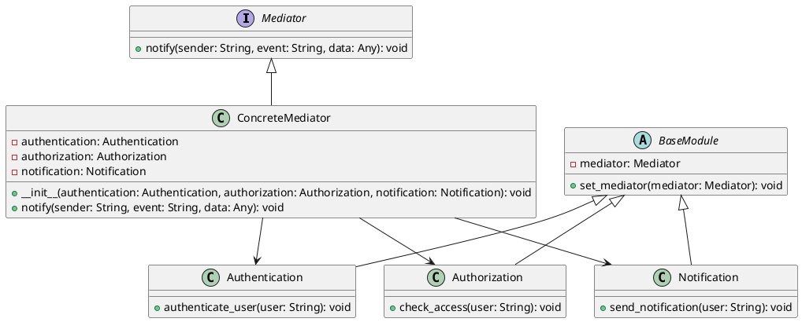

# Python

Мы — команда разработчиков, создающих систему управления пользователями. Наша цель — сделать так, чтобы все компоненты системы могли легко и эффективно взаимодействовать друг с другом. Для этого мы используем паттерн проектирования "Посредник" (Mediator). Этот паттерн помогает уменьшить зависимости между объектами, позволяя им общаться через посредника, а не напрямую.

### Описание кейса

В нашей системе управления пользователями есть несколько компонентов: модуль аутентификации, модуль авторизации и модуль уведомлений. Каждый из этих модулей выполняет свои задачи и должен быть в курсе того, что делают другие. Например, после успешной аутентификации пользователя, модуль авторизации должен проверить его права доступа, а модуль уведомлений должен отправить уведомление. Без посредника все эти модули должны были бы напрямую общаться друг с другом, что привело бы к сложной и запутанной системе.

### Применение паттерна "Посредник"

Паттерн "Посредник" позволяет нам создать центральный объект, который будет координировать взаимодействие между всеми модулями. Это упрощает коммуникацию и делает систему более гибкой и легкой в поддержке.

#### Пример кода на Python

**1. Интерфейс Посредника**


```python
from abc import ABC, abstractmethod

class Mediator(ABC):
    @abstractmethod
    def notify(self, sender: str, event: str, data=None):
        pass
```


**2. Конкретный Посредник**


```python
class ConcreteMediator(Mediator):
    def __init__(self, authentication, authorization, notification):
        self.authentication = authentication
        self.authorization = authorization
        self.notification = notification
        self.authentication.set_mediator(self)
        self.authorization.set_mediator(self)
        self.notification.set_mediator(self)

    def notify(self, sender: str, event: str, data=None):
        if sender == 'Authentication':
            if event == 'UserAuthenticated':
                self.authorization.check_access(data)
                self.notification.send_notification(data)
        elif sender == 'Authorization':
            if event == 'AccessGranted':
                self.notification.send_notification(data)
```


**3. Базовый класс модуля**


```python
class BaseModule:
    def __init__(self):
        self.mediator = None

    def set_mediator(self, mediator: Mediator):
        self.mediator = mediator
```


**4. Класс Аутентификации**


```python
class Authentication(BaseModule):
    def authenticate_user(self, user: str):
        # Логика аутентификации пользователя
        print(f"Authentication: Authenticating user: {user}")
        self.mediator.notify('Authentication', 'UserAuthenticated', user)
```


**5. Класс Авторизации**


```python
class Authorization(BaseModule):
    def check_access(self, user: str):
        # Логика проверки доступа пользователя
        print(f"Authorization: Checking access for user: {user}")
        self.mediator.notify('Authorization', 'AccessGranted', user)
```


**6. Класс Уведомлений**


```python
class Notification(BaseModule):
    def send_notification(self, user: str):
        # Логика отправки уведомления пользователю
        print(f"Notification: Sending notification to user: {user}")
```


#### Пример использования


```python
if __name__ == "__main__":
    authentication = Authentication()
    authorization = Authorization()
    notification = Notification()

    mediator = ConcreteMediator(authentication, authorization, notification)

    authentication.authenticate_user('User1')
```


### UML диаграмма

<figure><figcaption><p>UML диаграмма для паттерна "Посредник"</p></figcaption></figure>





### Вывод для кейса

Использование паттерна "Посредник" в нашей системе управления пользователями позволяет значительно упростить взаимодействие между различными модулями. Вместо того чтобы каждый модуль общался напрямую с другими, все взаимодействия проходят через центральный объект — посредника. Это делает систему более гибкой, легкой в поддержке и расширении. Модули аутентификации, авторизации и уведомлений могут сосредоточиться на своих задачах, не беспокоясь о том, как именно они будут взаимодействовать друг с другом.
